# Microservice Design – Hệ thống CAB

> Tài liệu này thiết kế kiến trúc microservice cho hệ thống CAB dựa trên `srs.md` (repo `23673071_HuynhGiaHan_cabsystem`), áp dụng **Domain-Driven Design (DDD)**: mỗi **Bounded Context (BC)** tương ứng **1 Microservice**, mỗi Microservice sở hữu **1 Database riêng** (Database-per-Service pattern), không chia sẻ schema/DB giữa các service.

---

## 0. Tổng quan kiến trúc

### 0.1. Nguyên tắc thiết kế

| # | Nguyên tắc | Diễn giải |
|---|---|---|
| 1 | 1 Bounded Context = 1 Microservice = 1 Database | Không có service nào truy cập trực tiếp DB của service khác. |
| 2 | Giao tiếp đồng bộ (REST/gRPC) | Dùng cho truy vấn cần phản hồi ngay (query, lookup). |
| 3 | Giao tiếp bất đồng bộ (Event, qua Message Broker – Kafka/RabbitMQ) | Dùng cho luồng nghiệp vụ xuyên nhiều BC (Trip → Dispatch → Fare → Payment → Notification), đảm bảo *loose coupling* và khả năng mở rộng (BG11, BG12, NFR02, NFR03). |
| 4 | Tham chiếu chéo service bằng ID (logical reference) | VD: `Trip.customer_id` không phải FK thật, chỉ là giá trị tham chiếu; dữ liệu chi tiết lấy qua API/event, không JOIN chéo DB. |
| 5 | Eventual Consistency + Saga Pattern | Các giao dịch xuyên service (đặt chuyến → tìm tài xế → tính cước → thanh toán) dùng **Choreography-based Saga**: mỗi service tự xử lý bước của mình và phát event, không có transaction phân tán 2PC. |
| 6 | Polyglot Persistence | Mỗi BC chọn loại DB phù hợp với đặc tính dữ liệu/truy vấn của chính nó, không ép dùng chung 1 loại DB. |

### 0.2. Danh sách Bounded Context → Microservice → Database

| # | Bounded Context | Microservice | FR chính | Loại Database |
|---|---|---|---|---|
| BC01 | Identity & Access Management | `identity-service` | FR01, FR02, FR03, FR30 | PostgreSQL (Relational) |
| BC02 | Customer Management | `customer-service` | FR03, FR24 | PostgreSQL (Relational) |
| BC03 | Driver & Vehicle Management | `driver-service` | FR21, FR22, FR23, FR25, FR26 | PostgreSQL (Relational) |
| BC04 | Trip Booking & Lifecycle | `trip-service` | FR04, FR05, FR12, FR19, FR27 | PostgreSQL (Relational) |
| BC05 | Dispatch (Tìm & điều phối tài xế) | `dispatch-service` | FR06, FR07, FR08, FR09 | Redis (In-memory + Geo) |
| BC06 | Location Tracking | `location-service` | FR10, FR11 | MongoDB (Document + Geospatial) |
| BC07 | Fare & Pricing | `fare-service` | FR13 | PostgreSQL (Relational) |
| BC08 | Payment & Transaction | `payment-service` | FR14, FR15, FR16, FR29 | PostgreSQL (Relational) |
| BC09 | Notification | `notification-service` | FR17, FR18 | MongoDB (Document) |
| BC10 | Rating & Feedback | `rating-service` | FR20 | PostgreSQL (Relational) |
| BC11 | Operations & Incident Management | `operations-service` | FR27, FR28 | Elasticsearch (Search/Document) |
| BC12 | Reporting & Analytics | `reporting-service` | FR31 | ClickHouse (Columnar OLAP) |
| BC13 | Audit & Compliance | `audit-service` | FR32 | Cassandra (Wide-column, append-only) |

### 0.3. Context Map (giao tiếp giữa các Bounded Context)

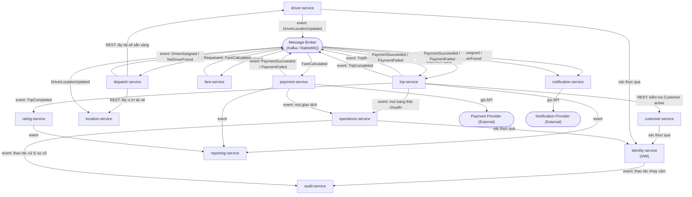

> **Ghi chú:** `dispatch-service` không gọi trực tiếp DB của `driver-service`/`location-service` mỗi lần tìm tài xế; thay vào đó `dispatch-service` duy trì **read-model cache** trong Redis (vị trí + trạng thái sẵn sàng của tài xế) được cập nhật liên tục qua event `DriverLocationUpdated` / `DriverStatusChanged`, phục vụ truy vấn theo bán kính (geo-radius) với độ trễ thấp (đáp ứng NFR01, NFR02).

---

## BC01 – Identity & Access Management (`identity-service`)

### 1. Bounded Context → FR, Workflow
- **FR liên quan:** FR01 (Đăng ký), FR02 (Đăng nhập), FR03 (một phần – xác thực trước khi cập nhật), FR30 (Phân quyền người dùng).
- **BR/BRL liên quan:** BRL01 (Khách hàng phải đăng nhập), BRL15 (Phân quyền quản trị), NFR05 (Authentication), NFR06 (Authorization – RBAC).
- **Workflow tóm tắt:**
  1. Người dùng (Customer/Driver/Staff) đăng ký tài khoản → hệ thống tạo `Account` với `role` tương ứng, mã hoá mật khẩu.
  2. Người dùng đăng nhập → xác thực → phát hành `access token` (JWT) + `refresh token`.
  3. Mỗi request tới các service khác đính kèm JWT; service gọi `identity-service` (hoặc verify JWT cục bộ bằng public key) để xác thực và lấy `role/permission`.
  4. Operations Manager gán vai trò cho Operations Staff (UC21) → kiểm tra quyền trước khi cho phép (BRL15).

### 2. Ubiquitous Language
| Thuật ngữ | Định nghĩa |
|---|---|
| Account | Danh tính đăng nhập (username/phone/email + password hash) gắn với 1 trong 3 role: Customer, Driver, Staff |
| Role | Vai trò xác định tập quyền (Customer, Driver, Operations Staff, Operations Manager, System Admin) |
| Permission | Một quyền hành động cụ thể (vd: `trip.view`, `driver.manage`, `report.view`) |
| Access Token | JWT ngắn hạn dùng để xác thực request |
| Refresh Token | Token dài hạn dùng để cấp lại Access Token khi hết hạn |

### 3. Microservice → APIs
| Method | Endpoint | Mô tả |
|---|---|---|
| POST | `/api/v1/auth/register` | Đăng ký tài khoản (Customer/Driver) – FR01 |
| POST | `/api/v1/auth/login` | Đăng nhập, trả về access/refresh token – FR02 |
| POST | `/api/v1/auth/refresh` | Cấp lại access token |
| POST | `/api/v1/auth/logout` | Thu hồi refresh token |
| GET | `/api/v1/accounts/{id}` | Lấy thông tin account (nội bộ service-to-service) |
| POST | `/api/v1/roles` | Tạo vai trò mới (Admin) |
| POST | `/api/v1/accounts/{id}/roles` | Gán vai trò cho tài khoản – FR30 |
| GET | `/api/v1/accounts/{id}/permissions` | Kiểm tra quyền (dùng bởi API Gateway/service khác) |

### 4. ERD → CSDL
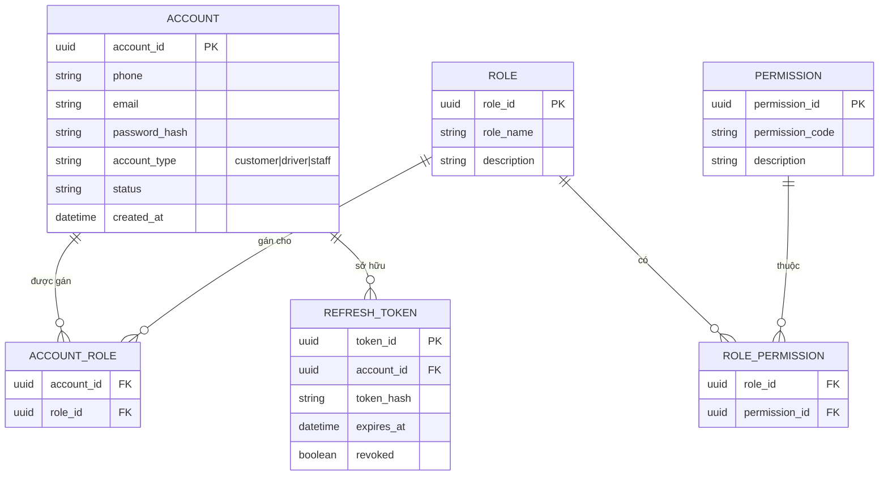
**CSDL (PostgreSQL – schema `identity`):** bảng `account`, `role`, `permission`, `account_role`, `role_permission`, `refresh_token`; index unique trên `phone`, `email`; FK ràng buộc nội bộ trong cùng DB.

### 5. Database Type
- **Loại:** PostgreSQL (Relational/RDBMS).
- **Lý do:** Dữ liệu xác thực/phân quyền có tính **toàn vẹn cao**, quan hệ nhiều-nhiều rõ ràng (Account–Role–Permission), cần ACID để tránh tình trạng cấp sai quyền, hỗ trợ transaction khi đăng ký (tạo account + gán role mặc định) (đáp ứng NFR06).

---

## BC02 – Customer Management (`customer-service`)

### 1. Bounded Context → FR, Workflow
- **FR liên quan:** FR03 (Cập nhật thông tin cá nhân), FR24 (Operations Staff quản lý khách hàng), FR19 (Xem lịch sử chuyến đi – đọc dữ liệu tổng hợp từ `trip-service` qua API/event).
- **BR liên quan:** BR06, BRL01.
- **Workflow tóm tắt:**
  1. Sau khi `identity-service` tạo Account (role = customer), `customer-service` lắng nghe event `AccountCreated` để tạo `CustomerProfile` tương ứng.
  2. Khách hàng cập nhật thông tin cá nhân (FR03) qua API.
  3. Operations Staff tra cứu/quản lý danh sách khách hàng (FR24), yêu cầu quyền phù hợp (kiểm tra qua `identity-service`).

### 2. Ubiquitous Language
| Thuật ngữ | Định nghĩa |
|---|---|
| Customer Profile | Hồ sơ thông tin cá nhân của khách hàng (tên, SĐT, email, trạng thái) |
| Customer Status | Trạng thái tài khoản khách hàng: active / inactive / suspended |
| Account Reference | `account_id` tham chiếu tới `identity-service`, không lưu password |

### 3. Microservice → APIs
| Method | Endpoint | Mô tả |
|---|---|---|
| GET | `/api/v1/customers/{id}` | Xem thông tin khách hàng |
| PUT | `/api/v1/customers/{id}` | Cập nhật thông tin cá nhân – FR03 |
| GET | `/api/v1/customers` | Operations Staff tra cứu danh sách khách hàng – FR24 |
| PATCH | `/api/v1/customers/{id}/status` | Khoá/mở khoá tài khoản khách hàng (Staff) |

### 4. ERD → CSDL
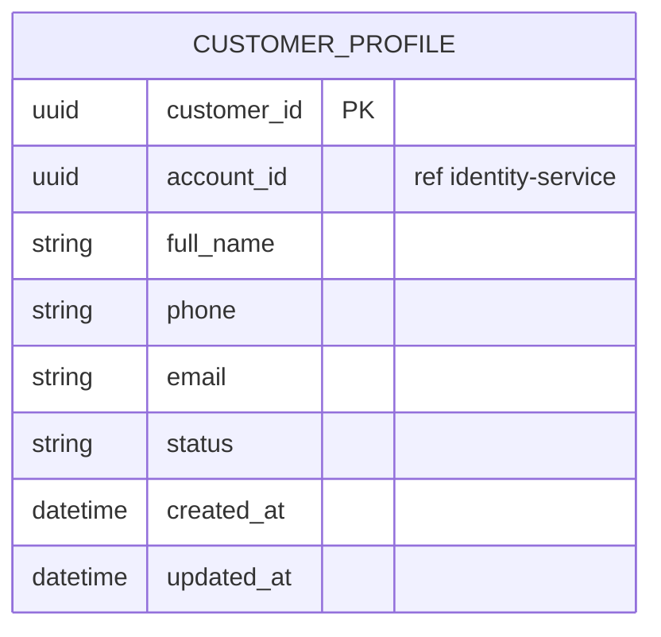
**CSDL (PostgreSQL – schema `customer`):** 1 bảng chính `customer_profile`; `account_id` không có FK vật lý (tham chiếu logic tới service khác).

### 5. Database Type
- **Loại:** PostgreSQL (Relational).
- **Lý do:** Dữ liệu hồ sơ khách hàng có cấu trúc ổn định, cần truy vấn chính xác (tìm theo SĐT/email), khối lượng ghi vừa phải, phù hợp mô hình quan hệ đơn giản, dễ tích hợp báo cáo qua CDC (Change Data Capture) sau này.

---

## BC03 – Driver & Vehicle Management (`driver-service`)

### 1. Bounded Context → FR, Workflow
- **FR liên quan:** FR21 (Quản lý hồ sơ tài xế), FR22 (Quản lý phương tiện), FR23 (Cập nhật trạng thái sẵn sàng), FR25 (Staff quản lý tài xế), FR26 (Staff quản lý phương tiện).
- **BR liên quan:** BR07, BRL02, BRL18.
- **Workflow tóm tắt:**
  1. Tài xế đăng ký → `identity-service` phát event `AccountCreated` (role = driver) → `driver-service` tạo `DriverProfile`.
  2. Tài xế khởi tạo/cập nhật hồ sơ và gắn phương tiện (`Vehicle`).
  3. Tài xế chuyển trạng thái `available/unavailable` (FR23) → phát event `DriverStatusChanged` để `dispatch-service`/`location-service` cập nhật read-model.
  4. Operations Staff quản lý (CRUD) tài xế/phương tiện (FR25, FR26).

### 2. Ubiquitous Language
| Thuật ngữ | Định nghĩa |
|---|---|
| Driver Profile | Hồ sơ tài xế (tên, giấy phép lái xe, rating tổng hợp, trạng thái) |
| Vehicle | Phương tiện gắn với 1 tài xế (biển số, loại xe, hãng, model) |
| Driver Availability Status | Trạng thái sẵn sàng nhận chuyến: `available` / `busy` / `offline` (BRL02, BRL18) |

### 3. Microservice → APIs
| Method | Endpoint | Mô tả |
|---|---|---|
| POST | `/api/v1/drivers` | Khởi tạo hồ sơ tài xế – FR21/UC09 |
| PUT | `/api/v1/drivers/{id}` | Cập nhật hồ sơ tài xế |
| POST | `/api/v1/drivers/{id}/vehicles` | Thêm phương tiện – FR22 |
| PUT | `/api/v1/drivers/{id}/status` | Cập nhật trạng thái sẵn sàng – FR23 |
| GET | `/api/v1/drivers?status=available&area=...` | Lấy danh sách tài xế sẵn sàng (dùng bởi `dispatch-service`) |
| GET | `/api/v1/drivers` | Staff tra cứu danh sách tài xế – FR25 |
| PUT | `/api/v1/vehicles/{id}` | Staff cập nhật thông tin phương tiện – FR26 |

### 4. ERD → CSDL
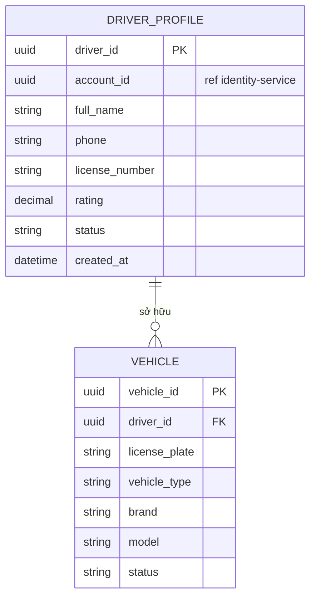
**CSDL (PostgreSQL – schema `driver`):** bảng `driver_profile`, `vehicle` với FK nội bộ `vehicle.driver_id → driver_profile.driver_id`.

### 5. Database Type
- **Loại:** PostgreSQL (Relational).
- **Lý do:** Quan hệ 1-N rõ ràng giữa Driver–Vehicle, cần ràng buộc toàn vẹn (1 tài xế có thể có nhiều xe nhưng phải hợp lệ), truy vấn lọc theo nhiều điều kiện (status, khu vực, loại xe) — phù hợp SQL có index kết hợp.

---

## BC04 – Trip Booking & Lifecycle (`trip-service`)

### 1. Bounded Context → FR, Workflow
- **FR liên quan:** FR04 (Nhập thông tin chuyến), FR05 (Tạo yêu cầu đặt chuyến), FR12 (Cập nhật trạng thái chuyến), FR19 (Lịch sử chuyến đi), FR27 (Staff theo dõi chuyến đang diễn ra).
- **BR liên quan:** BRL06 (1 chuyến 1 tài xế), BRL08 (trình tự trạng thái), BRL09.
- **Workflow tóm tắt (theo Bước 6.1 SRS):**
  1. Khách hàng gửi yêu cầu đặt chuyến → `trip-service` validate, tạo `Trip` (status = `SEARCHING_DRIVER`), phát event `TripRequested`.
  2. Nhận event `DriverAssigned` từ `dispatch-service` → cập nhật `Trip.driver_id`, status = `DRIVER_ASSIGNED`; hoặc `NoDriverFound` → status = `NO_DRIVER_FOUND` (EX01).
  3. Tài xế cập nhật trạng thái tuần tự qua `trip-service` (`ARRIVED` → `PICKED_UP` → `IN_PROGRESS` → `COMPLETED`) — ghi vào `TripStatusHistory` (BRL08).
  4. Khi `COMPLETED` → phát event `TripCompleted` để `fare-service`, `rating-service`, `reporting-service` xử lý tiếp.

### 2. Ubiquitous Language
| Thuật ngữ | Định nghĩa |
|---|---|
| Trip | Một chuyến đi, thực thể trung tâm, vòng đời từ khi đặt tới khi hoàn thành/huỷ |
| Trip Status | Trạng thái hiện tại: `SEARCHING_DRIVER, DRIVER_ASSIGNED, ARRIVED, PICKED_UP, IN_PROGRESS, COMPLETED, NO_DRIVER_FOUND, CANCELLED` |
| Trip Status History | Lịch sử đầy đủ các lần chuyển trạng thái của 1 Trip |
| Pickup / Destination | Điểm đón / điểm đến của chuyến đi |

### 3. Microservice → APIs
| Method | Endpoint | Mô tả |
|---|---|---|
| POST | `/api/v1/trips` | Tạo yêu cầu đặt chuyến – FR04/FR05 |
| GET | `/api/v1/trips/{id}` | Xem chi tiết + trạng thái chuyến – FR05 (theo dõi) |
| PATCH | `/api/v1/trips/{id}/status` | Tài xế cập nhật trạng thái – FR12 |
| GET | `/api/v1/customers/{id}/trips` | Lịch sử chuyến đi của khách hàng – FR19 |
| GET | `/api/v1/trips?status=in_progress` | Staff theo dõi chuyến đang diễn ra – FR27 |
| POST | `/api/v1/trips/{id}/cancel` | Huỷ chuyến (EX10) |

### 4. ERD → CSDL
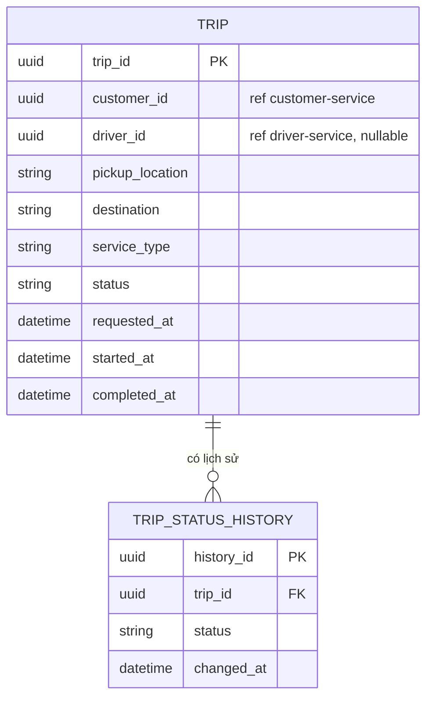
**CSDL (PostgreSQL – schema `trip`):** bảng `trip`, `trip_status_history`; index trên `customer_id`, `driver_id`, `status`, `requested_at` để hỗ trợ tra cứu lịch sử & dashboard vận hành.

### 5. Database Type
- **Loại:** PostgreSQL (Relational).
- **Lý do:** `Trip` là entity lõi cần **ACID mạnh** (trạng thái phải chuyển đúng trình tự – BRL08, không được ghi trùng/mất), nhiều truy vấn kết hợp điều kiện (theo customer, theo status, theo thời gian) — RDBMS đáp ứng tốt nhất tính nhất quán và transaction cho state machine.

---

## BC05 – Dispatch: Tìm & Điều phối tài xế (`dispatch-service`)

### 1. Bounded Context → FR, Workflow
- **FR liên quan:** FR06 (Tìm tài xế phù hợp), FR07 (Gửi yêu cầu đến tài xế), FR08 (Tìm tài xế tiếp theo), FR09 (Thông báo không tìm được tài xế).
- **BR liên quan:** BRL02, BRL03, BRL04, BRL05, BRL06, BRL07, BRL19; Exception EX01, EX02, EX03, EX13.
- **Workflow tóm tắt (theo Bước 6.3 SRS):**
  1. Nhận event `TripRequested` → xác định vị trí khách hàng, truy vấn read-model tài xế sẵn sàng trong bán kính (Redis GEO) đã đồng bộ từ `driver-service`/`location-service`.
  2. Lọc & xếp hạng ưu tiên tài xế (khoảng cách, rating…) → gửi yêu cầu tới tài xế ưu tiên cao nhất, chờ phản hồi trong khoảng thời gian cấu hình (TBC01).
  3. Nếu từ chối/hết hạn/tài xế mất trạng thái sẵn sàng (EX02, EX03, EX13) → loại khỏi danh sách, chọn tài xế tiếp theo (BRL05).
  4. Nếu chấp nhận → phát event `DriverAssigned`; nếu hết danh sách ứng viên → phát event `NoDriverFound` (EX01/FR09).

### 2. Ubiquitous Language
| Thuật ngữ | Định nghĩa |
|---|---|
| Dispatch Request | Một phiên tìm tài xế cho 1 Trip cụ thể |
| Candidate Driver | Tài xế ứng viên đủ điều kiện (sẵn sàng, trong bán kính) |
| Matching Score | Điểm ưu tiên dùng để xếp hạng candidate (khoảng cách, rating, thời gian đến ước tính) |
| Response Timeout | Thời gian tối đa tài xế phải phản hồi trước khi hệ thống coi là từ chối (TBC01) |

### 3. Microservice → APIs
| Method | Endpoint | Mô tả |
|---|---|---|
| POST | `/api/v1/dispatch` | Khởi tạo phiên tìm tài xế cho 1 Trip (nội bộ, thường trigger qua event) – FR06 |
| POST | `/api/v1/dispatch/{id}/driver-response` | Ghi nhận phản hồi Chấp nhận/Từ chối của tài xế – FR07/FR08 |
| GET | `/api/v1/dispatch/{id}` | Xem trạng thái phiên điều phối hiện tại |
| GET | `/api/v1/dispatch/{id}/candidates` | Xem danh sách ứng viên đã/đang thử (phục vụ Ops) |

### 4. ERD → CSDL
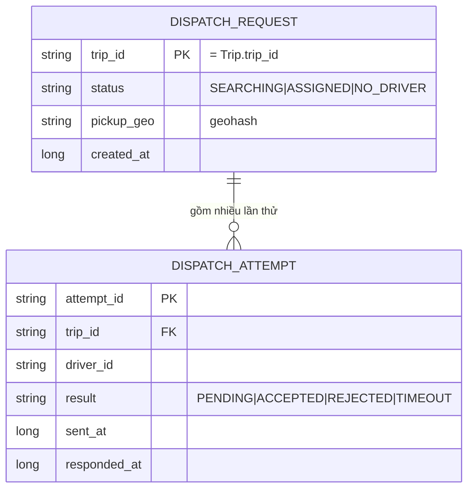
**CSDL (Redis):** 
- `dispatch:request:{trip_id}` (Hash) — trạng thái phiên điều phối, TTL ngắn.
- `driver:geo` (Sorted Set / GEO) — read-model vị trí + trạng thái sẵn sàng tài xế, cập nhật realtime từ event.
- `dispatch:attempts:{trip_id}` (List/Stream) — lịch sử các lần thử trong phiên, TTL sau khi Trip kết thúc (dữ liệu dài hạn được đẩy sang `reporting-service`/`operations-service` qua event, không lưu vĩnh viễn ở đây).

### 5. Database Type
- **Loại:** Redis (In-memory Key-Value + Geospatial).
- **Lý do:** Đây là bài toán **thời gian thực, độ trễ thấp** (tìm tài xế trong bán kính, xếp hạng, chờ phản hồi có timeout) — Redis GEO (`GEOSEARCH`) cho phép truy vấn bán kính cực nhanh; dữ liệu có vòng đời ngắn (chỉ tồn tại trong lúc điều phối) nên không cần độ bền cao như RDBMS, ưu tiên **hiệu năng** (đáp ứng NFR01, NFR04).

---

## BC06 – Location Tracking (`location-service`)

### 1. Bounded Context → FR, Workflow
- **FR liên quan:** FR10 (Cập nhật vị trí tài xế), FR11 (Khách hàng theo dõi vị trí tài xế).
- **BR liên quan:** BRL19; Exception EX11 (không xác định được vị trí).
- **Workflow tóm tắt:**
  1. Ứng dụng tài xế gửi vị trí định kỳ → `location-service` lưu bản ghi mới + cập nhật "vị trí hiện tại", phát event `DriverLocationUpdated` (để `dispatch-service` cập nhật Redis GEO read-model).
  2. Khách hàng theo dõi chuyến → gọi API lấy vị trí tài xế hiện tại + ETA (ước tính đơn giản dựa trên khoảng cách).

### 2. Ubiquitous Language
| Thuật ngữ | Định nghĩa |
|---|---|
| Location Ping | Một bản ghi vị trí (lat, long, timestamp) do tài xế gửi lên |
| Current Location | Vị trí mới nhất của 1 tài xế |
| ETA (Estimated Time of Arrival) | Thời gian dự kiến tài xế đến điểm đón/đến |

### 3. Microservice → APIs
| Method | Endpoint | Mô tả |
|---|---|---|
| POST | `/api/v1/drivers/{id}/locations` | Tài xế gửi vị trí mới – FR10 |
| GET | `/api/v1/drivers/{id}/locations/current` | Lấy vị trí hiện tại của tài xế – FR11 |
| GET | `/api/v1/trips/{id}/tracking` | Khách hàng theo dõi tài xế + ETA theo Trip – FR11 |
| GET | `/api/v1/drivers/{id}/locations/history` | Lịch sử vị trí (phục vụ điều tra sự cố) |

### 4. ERD → CSDL
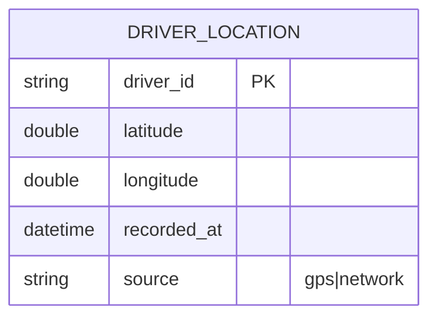
**CSDL (MongoDB – collection `driver_location`):**
```json
{
  "driver_id": "uuid",
  "location": { "type": "Point", "coordinates": [lng, lat] },
  "recorded_at": "ISODate",
  "ttl_expire_at": "ISODate"
}
```
- Index `2dsphere` trên `location` để hỗ trợ truy vấn không gian; TTL index trên `ttl_expire_at` để tự động xoá dữ liệu lịch sử cũ theo chính sách lưu trữ (TBC08).

### 5. Database Type
- **Loại:** MongoDB (Document, hỗ trợ Geospatial Index).
- **Lý do:** Khối lượng ghi rất lớn, tần suất cao (mỗi vài giây/tài xế), schema đơn giản dạng document, cần index địa lý (`2dsphere`) để truy vấn "gần điểm X trong bán kính Y", và TTL index để tự dọn dữ liệu cũ — phù hợp hơn RDBMS truyền thống cho dữ liệu ghi-nhiều, đọc-gần-đây.

---

## BC07 – Fare & Pricing (`fare-service`)

### 1. Bounded Context → FR, Workflow
- **FR liên quan:** FR13 (Tính cước chuyến đi).
- **BR liên quan:** BRL10 (Tính cước sau khi hoàn thành).
- **Workflow tóm tắt (theo Bước 6.4 SRS):**
  1. Nhận event `TripCompleted` (kèm distance, duration, service_type) → áp dụng `PricingRule` tương ứng `service_type` → tính `amount`.
  2. Lưu bản ghi `Fare`, phát event `FareCalculated` để `payment-service` xử lý thanh toán.

### 2. Ubiquitous Language
| Thuật ngữ | Định nghĩa |
|---|---|
| Fare | Cước phí đã tính cho 1 chuyến hoàn thành |
| Pricing Rule | Quy tắc tính giá theo loại dịch vụ (giá mở cửa, giá/km, giá/phút…) |
| Service Type | Loại xe/dịch vụ (4 chỗ, 7 chỗ, xe máy…) |

### 3. Microservice → APIs
| Method | Endpoint | Mô tả |
|---|---|---|
| POST | `/api/v1/fares/calculate` | Tính cước cho 1 Trip (thường trigger nội bộ qua event) – FR13 |
| GET | `/api/v1/fares/{trip_id}` | Xem chi tiết cước phí của 1 chuyến |
| GET | `/api/v1/pricing-rules` | Xem danh sách quy tắc giá theo dịch vụ |
| PUT | `/api/v1/pricing-rules/{id}` | Cập nhật quy tắc giá (Admin) |

### 4. ERD → CSDL
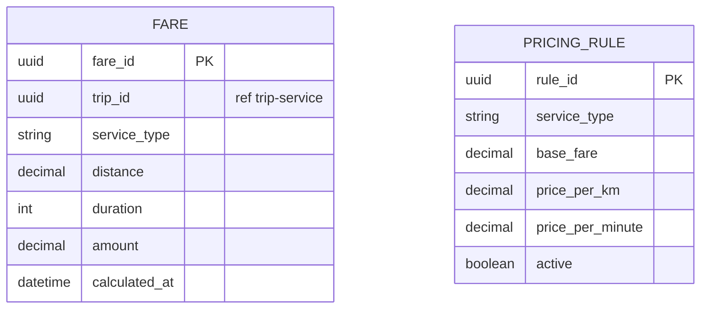
**CSDL (PostgreSQL – schema `fare`):** bảng `fare`, `pricing_rule`; `fare.trip_id` unique (1 Trip – 1 Fare theo quan hệ 1:1 trong SRS).

### 5. Database Type
- **Loại:** PostgreSQL (Relational).
- **Lý do:** Dữ liệu tài chính cần **chính xác tuyệt đối** (kiểu `decimal`, không sai lệch làm tròn), có ràng buộc nghiệp vụ rõ ràng (1 Trip – 1 Fare), truy vấn báo cáo đơn giản theo service_type/thời gian — RDBMS phù hợp cho tính toán tài chính có kiểm toán.

---

## BC08 – Payment & Transaction (`payment-service`)

### 1. Bounded Context → FR, Workflow
- **FR liên quan:** FR14 (Thanh toán tiền mặt), FR15 (Thanh toán điện tử), FR16 (Xử lý thanh toán thất bại), FR29 (Tra cứu giao dịch).
- **BR liên quan:** BRL10, BRL11, BRL12, BRL13; Exception EX06, EX07.
- **Workflow tóm tắt (theo Bước 6.4 SRS):**
  1. Nhận event `FareCalculated` → hiển thị số tiền, chờ khách hàng chọn phương thức.
  2. Tiền mặt: ghi nhận trực tiếp `Payment.status = SUCCESS`.
  3. Điện tử: gọi Payment Provider → nhận kết quả → `SUCCESS` hoặc `FAILED` (EX06) → nếu Provider không phản hồi → `PENDING_RECONCILE` (EX07).
  4. Phát event `PaymentSucceeded`/`PaymentFailed` để `trip-service` và `notification-service` xử lý tiếp; cho phép thanh toán lại nếu thất bại (theo chính sách TBC06).

### 2. Ubiquitous Language
| Thuật ngữ | Định nghĩa |
|---|---|
| Payment | 1 giao dịch thanh toán cho 1 Trip (có thể có nhiều lần nếu thất bại và thử lại) |
| Payment Method | Phương thức thanh toán: tiền mặt / điện tử (thẻ, ví…) |
| Transaction Code | Mã giao dịch do Payment Provider trả về |
| Reconciliation | Đối soát giao dịch giữa CAB và Payment Provider |

### 3. Microservice → APIs
| Method | Endpoint | Mô tả |
|---|---|---|
| POST | `/api/v1/payments` | Tạo giao dịch thanh toán (chọn phương thức) – FR14/FR15 |
| POST | `/api/v1/payments/{id}/retry` | Thanh toán lại sau khi thất bại – FR16 |
| GET | `/api/v1/payments/{id}` | Xem chi tiết giao dịch |
| GET | `/api/v1/trips/{trip_id}/payments` | Lịch sử các lần thanh toán của 1 chuyến |
| GET | `/api/v1/payments?status=pending_reconcile` | Tra cứu giao dịch phục vụ đối soát – FR29 |
| POST | `/api/v1/payments/webhook/provider-callback` | Nhận callback kết quả từ Payment Provider |

### 4. ERD → CSDL
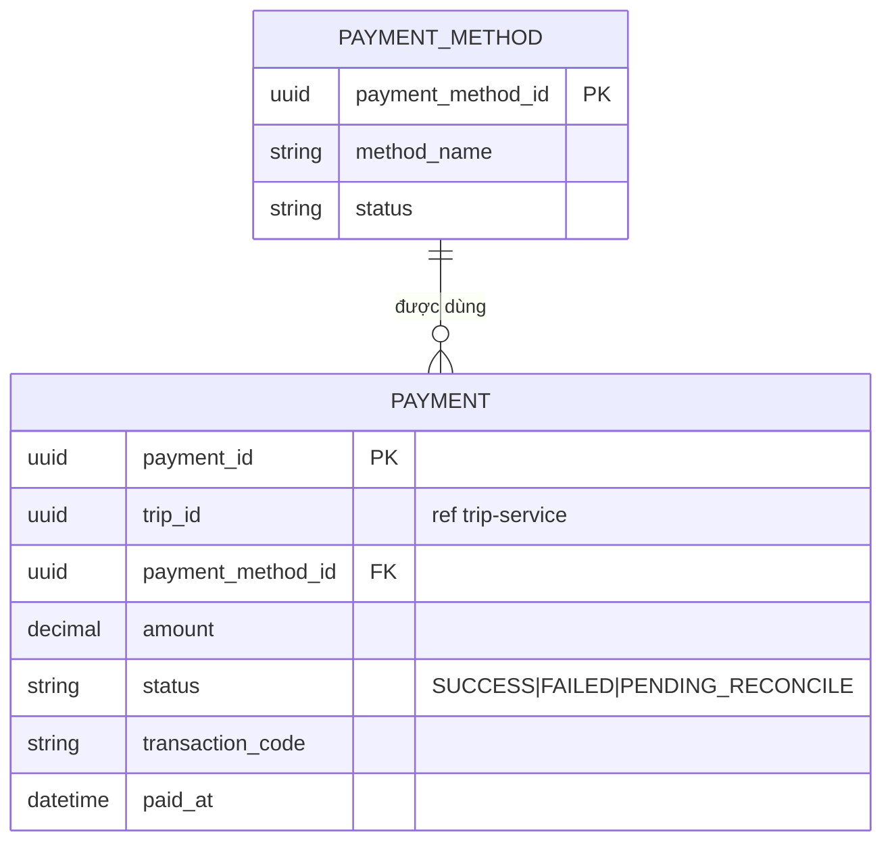
**CSDL (PostgreSQL – schema `payment`):** bảng `payment`, `payment_method`; **không** lưu thông tin thẻ/tài khoản nhạy cảm (BRL12, NFR08) — chỉ lưu `transaction_code` tham chiếu tới Payment Provider.

### 5. Database Type
- **Loại:** PostgreSQL (Relational).
- **Lý do:** Giao dịch tài chính bắt buộc **ACID** (không được mất/trùng giao dịch), cần transaction khi cập nhật trạng thái, hỗ trợ truy vấn đối soát phức tạp (theo trạng thái, khoảng thời gian, phương thức) — đây là service quan trọng nhất về tính nhất quán dữ liệu.

---

## BC09 – Notification (`notification-service`)

### 1. Bounded Context → FR, Workflow
- **FR liên quan:** FR17 (Thông báo cho khách hàng), FR18 (Thông báo cho tài xế).
- **BR liên quan:** BRL17; Exception EX08 (Notification Provider lỗi).
- **Workflow tóm tắt:**
  1. Lắng nghe các event nghiệp vụ (`TripRequested`, `DriverAssigned`, `NoDriverFound`, `PaymentSucceeded/Failed`, `TripStatusChanged`…) từ Message Broker.
  2. Dựng nội dung theo `NotificationTemplate` tương ứng loại sự kiện + kênh (SMS/Email/Push).
  3. Gửi qua Notification Provider; nếu lỗi (EX08) → ghi nhận `status = FAILED`, có thể retry hoặc chuyển kênh khác nếu cấu hình.

### 2. Ubiquitous Language
| Thuật ngữ | Định nghĩa |
|---|---|
| Notification | 1 thông báo gửi tới Customer/Driver về 1 sự kiện cụ thể |
| Notification Channel | Kênh gửi: SMS, Email, Push Notification |
| Notification Template | Mẫu nội dung theo loại sự kiện (đa ngôn ngữ nếu cần) |

### 3. Microservice → APIs
| Method | Endpoint | Mô tả |
|---|---|---|
| POST | `/api/v1/notifications` | Gửi thông báo (thường trigger nội bộ qua event) |
| GET | `/api/v1/notifications/{recipient_id}` | Xem lịch sử thông báo của 1 người nhận |
| POST | `/api/v1/notifications/{id}/retry` | Gửi lại thông báo thất bại (EX08) |
| GET | `/api/v1/notification-templates` | Quản lý mẫu thông báo (Admin) |

### 4. ERD → CSDL
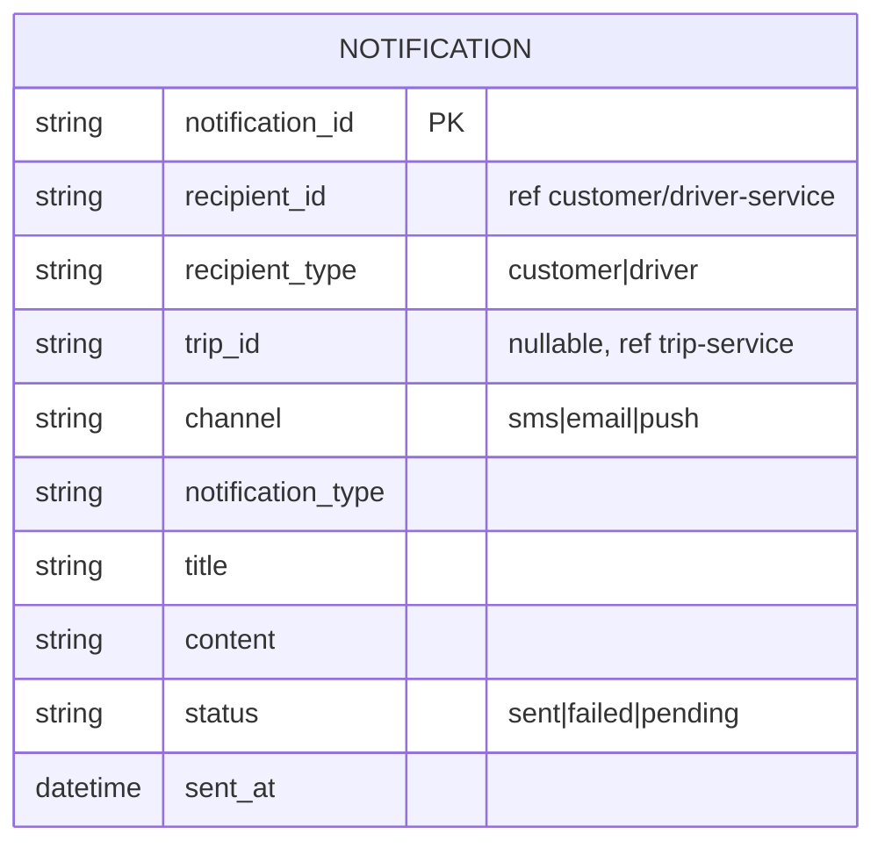
**CSDL (MongoDB – collection `notification`):** schema linh hoạt vì mỗi loại sự kiện có payload/nội dung khác nhau; không cần transaction phức tạp, chủ yếu ghi (write-heavy) và đọc theo `recipient_id`.

### 5. Database Type
- **Loại:** MongoDB (Document).
- **Lý do:** Nội dung thông báo đa dạng theo loại sự kiện/kênh (schema thay đổi linh hoạt), khối lượng ghi lớn, không đòi hỏi quan hệ phức tạp hay ACID nghiêm ngặt như dữ liệu tài chính — Document DB cho tốc độ ghi cao và dễ mở rộng thêm loại thông báo mới (BG12, NFR11).

---

## BC10 – Rating & Feedback (`rating-service`)

### 1. Bounded Context → FR, Workflow
- **FR liên quan:** FR20 (Đánh giá tài xế).
- **BR liên quan:** BRL14 (Chỉ đánh giá sau khi hoàn thành).
- **Workflow tóm tắt:**
  1. Nhận event `TripCompleted` → cho phép khách hàng gửi đánh giá (score, comment) trong khoảng thời gian quy định (TBC09).
  2. Lưu `Rating`, phát event `RatingSubmitted` để `driver-service` cập nhật `rating` trung bình của tài xế (đọc-tổng hợp) và `reporting-service` dùng cho báo cáo hiệu quả tài xế.

### 2. Ubiquitous Language
| Thuật ngữ | Định nghĩa |
|---|---|
| Rating | 1 đánh giá (điểm số + nhận xét) của khách hàng dành cho tài xế sau 1 chuyến |
| Score | Điểm đánh giá (vd 1–5 sao) |

### 3. Microservice → APIs
| Method | Endpoint | Mô tả |
|---|---|---|
| POST | `/api/v1/trips/{trip_id}/rating` | Gửi đánh giá tài xế – FR20 |
| GET | `/api/v1/drivers/{driver_id}/ratings` | Xem danh sách đánh giá của 1 tài xế |
| GET | `/api/v1/trips/{trip_id}/rating` | Xem đánh giá của 1 chuyến |

### 4. ERD → CSDL
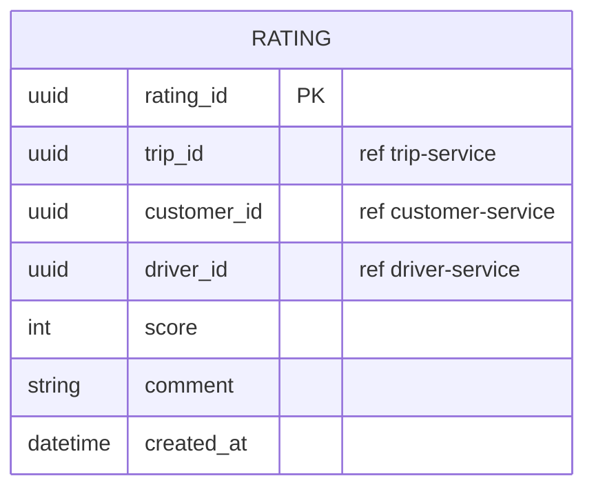
**CSDL (PostgreSQL – schema `rating`):** bảng `rating`, unique constraint trên `trip_id` (1 chuyến – tối đa 1 đánh giá theo quan hệ 1:0..1 trong SRS).

### 5. Database Type
- **Loại:** PostgreSQL (Relational).
- **Lý do:** Dữ liệu đơn giản nhưng cần ràng buộc duy nhất (1 Trip – 1 Rating) và tổng hợp (AVG rating theo driver_id) — RDBMS đủ nhẹ và chính xác cho truy vấn tổng hợp này, không cần đặc tính NoSQL.

---

## BC11 – Operations & Incident Management (`operations-service`)

### 1. Bounded Context → FR, Workflow
- **FR liên quan:** FR27 (Theo dõi chuyến đang diễn ra – dashboard tổng hợp), FR28 (Xử lý chuyến bất thường).
- **BR liên quan:** BRL15, BRL16; Exception EX09, EX12, EX14.
- **Workflow tóm tắt (theo Bước 6.2 SRS):**
  1. Lắng nghe toàn bộ event từ `trip-service`, `dispatch-service`, `payment-service`, `location-service` → xây **read-model tổng hợp** (CQRS) phục vụ dashboard giám sát thời gian thực (NFR14).
  2. Khi phát hiện bất thường (EX09 – tài xế không cập nhật trạng thái đúng hạn, EX12 – lỗi hệ thống, EX14 – chuyến lỗi) → tạo `IncidentCase`.
  3. Operations Staff xem danh sách, xử lý (gán lại tài xế, huỷ chuyến, ghi chú) → thao tác được gửi event sang `audit-service` (UC26).

### 2. Ubiquitous Language
| Thuật ngữ | Định nghĩa |
|---|---|
| Incident Case | 1 trường hợp chuyến bất thường cần Operations Staff can thiệp |
| Trip Monitoring View | Read-model tổng hợp trạng thái các chuyến đang diễn ra (denormalized từ nhiều BC) |
| Resolution Action | Hành động xử lý sự cố (gán lại tài xế, huỷ chuyến, đánh dấu đã xử lý) |

### 3. Microservice → APIs
| Method | Endpoint | Mô tả |
|---|---|---|
| GET | `/api/v1/ops/trips/live` | Dashboard chuyến đang diễn ra – FR27 |
| GET | `/api/v1/ops/incidents` | Danh sách chuyến bất thường – FR28 |
| GET | `/api/v1/ops/incidents/{id}` | Chi tiết 1 incident |
| POST | `/api/v1/ops/incidents/{id}/resolve` | Xử lý sự cố (gán lại tài xế/huỷ chuyến/ghi chú) – FR28 |

### 4. ERD → CSDL
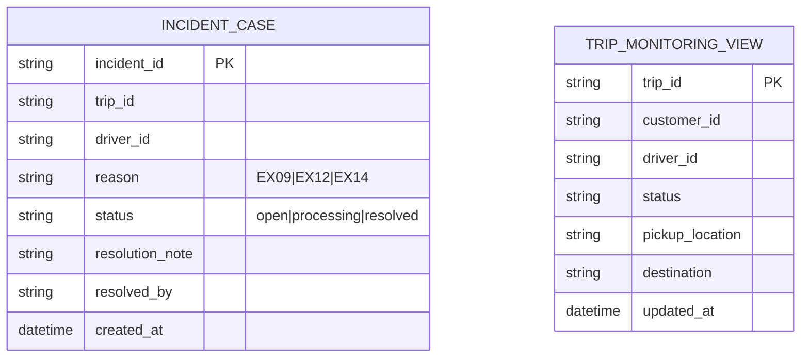
**CSDL (Elasticsearch – index `incident_case`, `trip_monitoring_view`):** dữ liệu document, đồng bộ (denormalize) từ event của các BC khác, tối ưu cho tìm kiếm/lọc đa điều kiện trên dashboard (theo status, khu vực, thời gian, từ khoá).

### 5. Database Type
- **Loại:** Elasticsearch (Search Engine/Document).
- **Lý do:** Đây là BC thiên về **giám sát & tìm kiếm thời gian gần thực** trên dữ liệu tổng hợp từ nhiều service khác (CQRS read-side), cần full-text search, filter/aggregation nhanh trên khối lượng lớn bản ghi chuyến — Elasticsearch tối ưu cho use case dashboard/monitoring hơn RDBMS (đáp ứng NFR14).

---

## BC12 – Reporting & Analytics (`reporting-service`)

### 1. Bounded Context → FR, Workflow
- **FR liên quan:** FR31 (Xem báo cáo hoạt động: số lượng chuyến, doanh thu, tỷ lệ hoàn thành, tỷ lệ hủy, hiệu quả tài xế).
- **BR liên quan:** BR18.
- **Workflow tóm tắt:**
  1. Lắng nghe event `TripCompleted`, `TripCancelled`, `PaymentSucceeded`, `RatingSubmitted`… từ các BC khác → ETL/stream vào các bảng **fact** dạng OLAP (ETL bất đồng bộ, không ảnh hưởng hệ thống giao dịch – NFR03).
  2. Operations Manager truy vấn báo cáo tổng hợp theo khoảng thời gian/khu vực/tài xế.

### 2. Ubiquitous Language
| Thuật ngữ | Định nghĩa |
|---|---|
| Trip Fact | Bản ghi sự kiện chuyến đi phục vụ phân tích (1 dòng = 1 chuyến, đã hoàn thành/huỷ) |
| Revenue Fact | Bản ghi doanh thu theo chuyến/ngày/khu vực |
| Driver Performance | Số liệu hiệu quả tài xế (số chuyến, tỷ lệ chấp nhận, rating trung bình) |

### 3. Microservice → APIs
| Method | Endpoint | Mô tả |
|---|---|---|
| GET | `/api/v1/reports/trips-summary?from=&to=` | Báo cáo số lượng/tỷ lệ hoàn thành/huỷ – FR31 |
| GET | `/api/v1/reports/revenue?from=&to=&groupBy=day` | Báo cáo doanh thu – FR31 |
| GET | `/api/v1/reports/driver-performance` | Báo cáo hiệu quả tài xế – FR31 |

### 4. ERD → CSDL
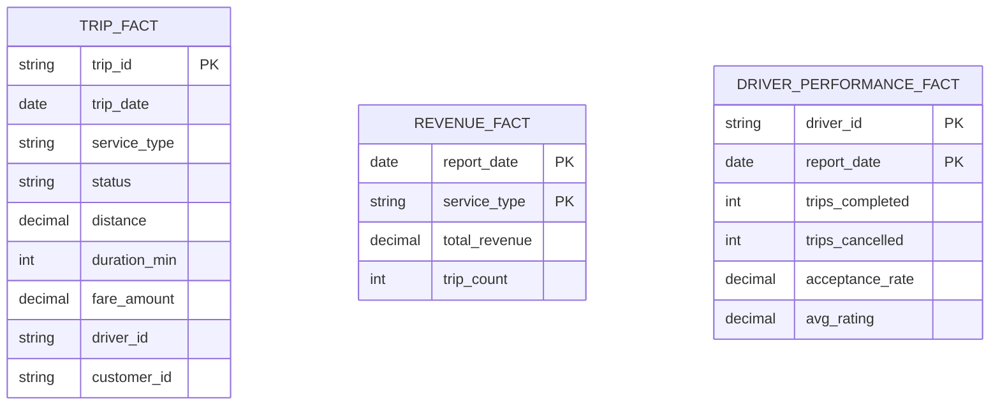
**CSDL (ClickHouse):** bảng dạng **columnar**, partition theo ngày (`toYYYYMM(trip_date)`), engine `MergeTree`; dữ liệu nạp qua stream (Kafka Connect/ETL) từ các event của các BC khác, không truy vấn ngược vào DB giao dịch.

### 5. Database Type
- **Loại:** ClickHouse (Columnar OLAP).
- **Lý do:** Báo cáo cần **aggregation nhanh trên dữ liệu lớn** (SUM, COUNT, AVG theo ngày/khu vực/loại dịch vụ), đọc nhiều-ghi ít theo lô (batch/stream), không cần cập nhật từng dòng như OLTP — Columnar DB tối ưu tốc độ truy vấn phân tích hơn hẳn RDBMS thông thường.

---

## BC13 – Audit & Compliance (`audit-service`)

### 1. Bounded Context → FR, Workflow
- **FR liên quan:** FR32 (Ghi nhận lịch sử thao tác – Audit Log).
- **BR liên quan:** BRL16, BR20, NFR09.
- **Workflow tóm tắt (theo Bước 6.2 SRS – UC26):**
  1. Mọi thao tác quản trị/nhạy cảm ở các BC khác (`identity-service`, `driver-service`, `customer-service`, `operations-service`…) phát event `SensitiveActionPerformed` (ai, hành động gì, đối tượng nào, khi nào).
  2. `audit-service` chỉ **ghi (append-only)**, không cho sửa/xoá, phục vụ tra vết khi có sự cố (NFR09).

### 2. Ubiquitous Language
| Thuật ngữ | Định nghĩa |
|---|---|
| Audit Log | 1 bản ghi bất biến mô tả 1 thao tác quan trọng đã xảy ra trong hệ thống |
| Actor | Người/hệ thống thực hiện thao tác (staff_id, system) |
| Entity Reference | Đối tượng bị tác động (entity_type + entity_id), tham chiếu logic |

### 3. Microservice → APIs
| Method | Endpoint | Mô tả |
|---|---|---|
| POST | `/api/v1/audit-logs` | Ghi 1 bản ghi audit (thường qua consumer event, hiếm khi gọi trực tiếp) |
| GET | `/api/v1/audit-logs?entity_type=&entity_id=` | Tra cứu lịch sử thao tác trên 1 đối tượng |
| GET | `/api/v1/audit-logs?actor_id=&from=&to=` | Tra cứu thao tác theo người thực hiện/khoảng thời gian |

### 4. ERD → CSDL
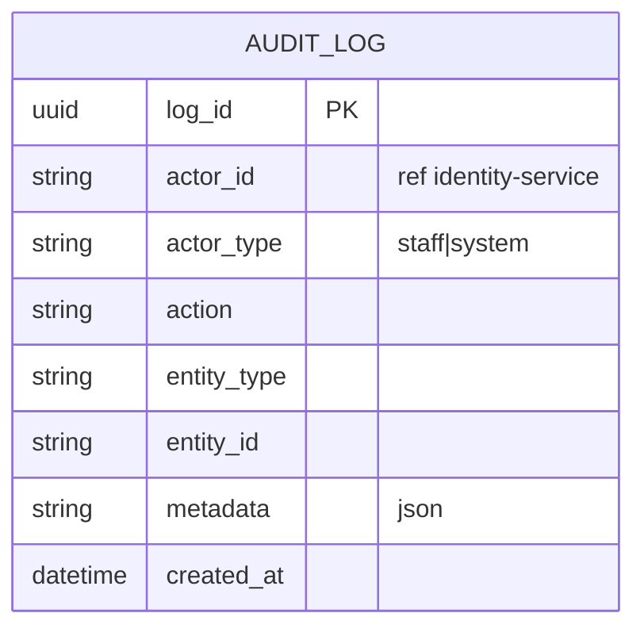
**CSDL (Cassandra – table `audit_log`):** partition key = `entity_type` (hoặc theo tháng `yyyymm`), clustering key = `created_at DESC`; tối ưu cho **ghi liên tục, không update**, đọc theo range thời gian/đối tượng.

### 5. Database Type
- **Loại:** Cassandra (Wide-column, append-only).
- **Lý do:** Audit log có đặc tính **ghi rất nhiều, gần như không bao giờ update/xoá**, cần khả năng mở rộng ghi theo chiều ngang (write-scalability) khi hệ thống tăng trưởng (BG11, NFR02), và không cần transaction phức tạp — Cassandra phù hợp cho workload ghi-nặng, chịu lỗi cao, phân tán multi-node.

---

## Phụ lục A – Bảng tổng hợp Database theo BC (đối chiếu yêu cầu polyglot persistence)

| Loại Database | Bounded Context sử dụng | Đặc tính khai thác |
|---|---|---|
| PostgreSQL (Relational) | IAM, Customer, Driver & Vehicle, Trip, Fare, Payment, Rating | Cần ACID, quan hệ rõ ràng, dữ liệu tài chính/giao dịch/trạng thái quan trọng |
| Redis (In-memory + Geo) | Dispatch | Cần độ trễ cực thấp, dữ liệu vòng đời ngắn, truy vấn theo bán kính |
| MongoDB (Document + Geo) | Location Tracking, Notification | Ghi nhiều, schema linh hoạt, cần geospatial/TTL index |
| Elasticsearch (Search) | Operations & Incident | Cần full-text search, filter/aggregation nhanh cho dashboard |
| ClickHouse (Columnar OLAP) | Reporting & Analytics | Cần aggregation nhanh trên dữ liệu lớn, đọc nhiều-ghi theo lô |
| Cassandra (Wide-column) | Audit & Compliance | Ghi liên tục, append-only, cần mở rộng ghi theo chiều ngang |

## Phụ lục B – Danh mục Domain Event chính (giao tiếp bất đồng bộ giữa các BC)

| Event | Publisher | Consumer(s) |
|---|---|---|
| `AccountCreated` | identity-service | customer-service, driver-service |
| `TripRequested` | trip-service | dispatch-service, operations-service, reporting-service |
| `DriverStatusChanged` | driver-service | dispatch-service |
| `DriverLocationUpdated` | location-service | dispatch-service |
| `DriverAssigned` / `NoDriverFound` | dispatch-service | trip-service, notification-service, operations-service |
| `TripStatusChanged` | trip-service | notification-service, operations-service, reporting-service |
| `TripCompleted` | trip-service | fare-service, rating-service, operations-service, reporting-service |
| `FareCalculated` | fare-service | payment-service |
| `PaymentSucceeded` / `PaymentFailed` | payment-service | trip-service, notification-service, operations-service, reporting-service |
| `RatingSubmitted` | rating-service | driver-service, reporting-service |
| `SensitiveActionPerformed` | identity-service, driver-service, customer-service, operations-service | audit-service |

> **Ghi chú thiết kế:** Các ngưỡng định lượng (TBC01 – thời gian phản hồi tài xế, TBC03 – bán kính tìm tài xế, TBC08 – thời gian lưu trữ dữ liệu…) hiện chưa được khách hàng chốt trong SRS; các service liên quan (`dispatch-service`, `location-service`) cần thiết kế các giá trị này dưới dạng **cấu hình động (config-driven)**, không hard-code, để dễ điều chỉnh khi có quyết định chính thức.
