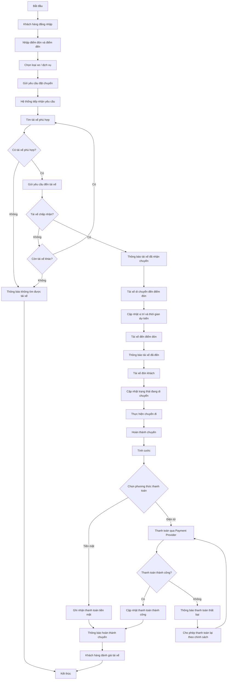
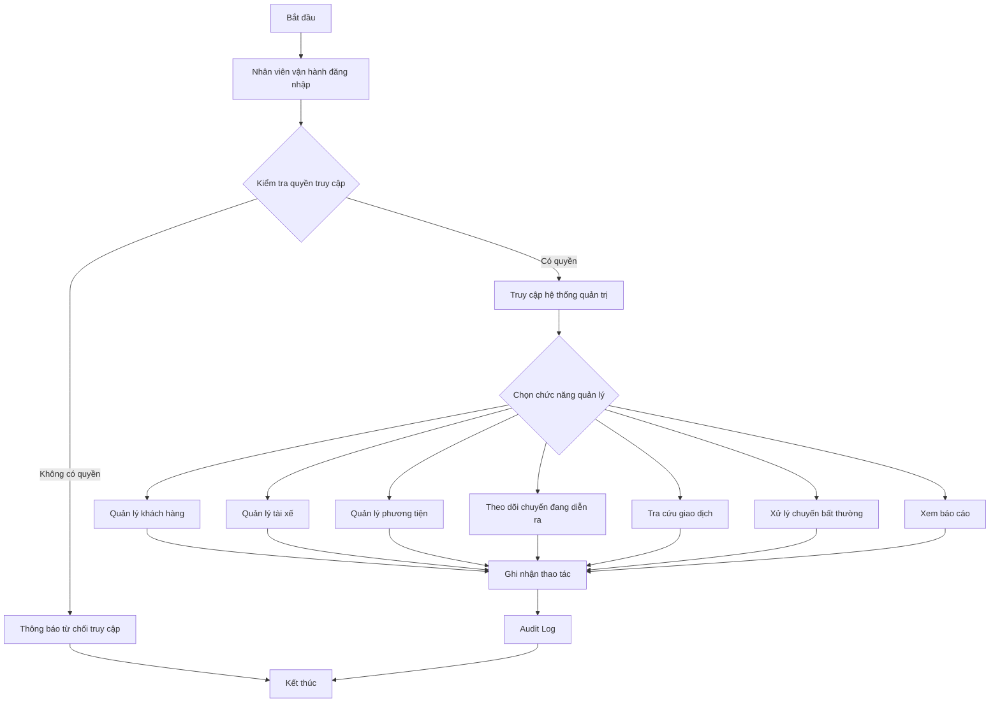
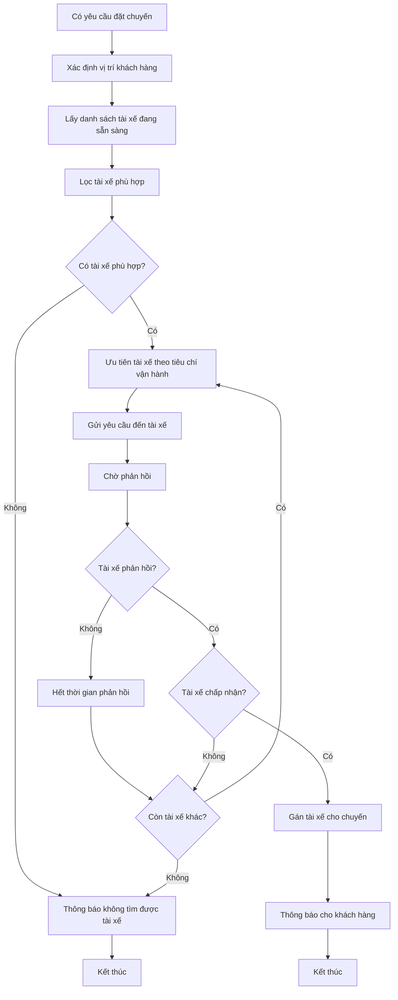
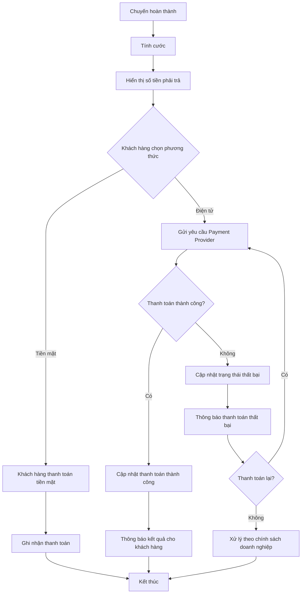
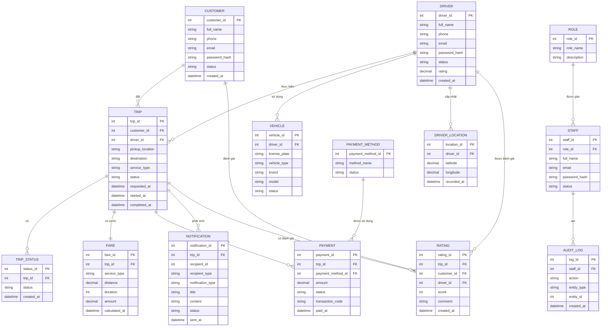
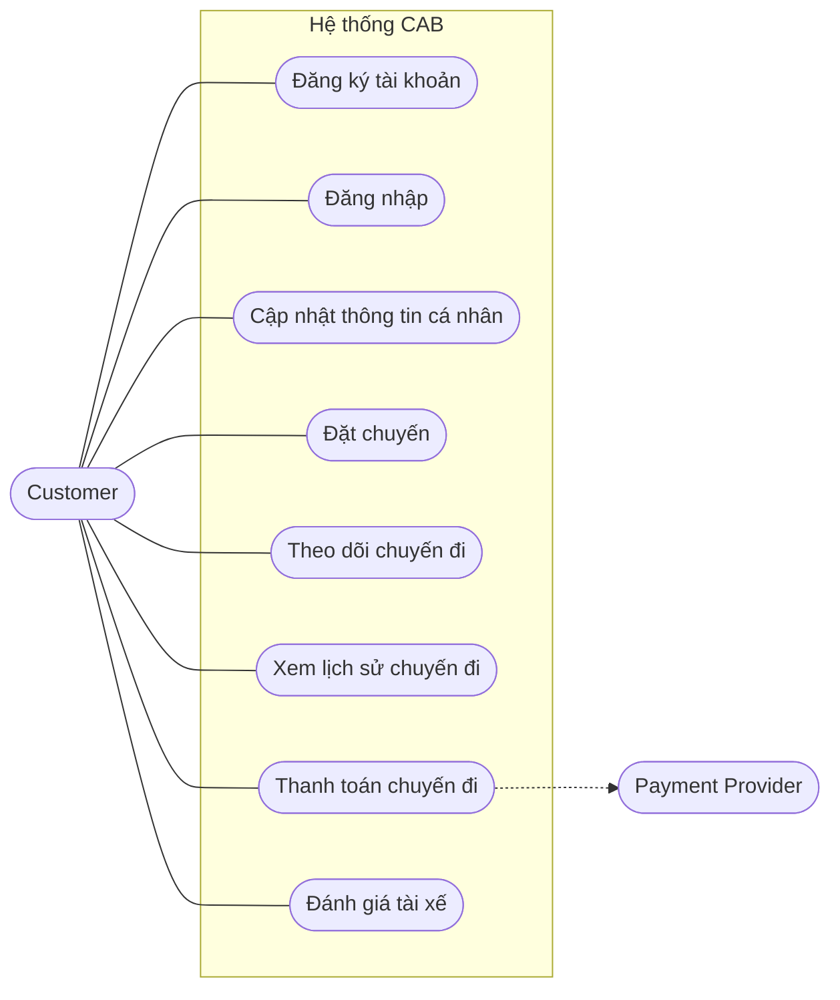
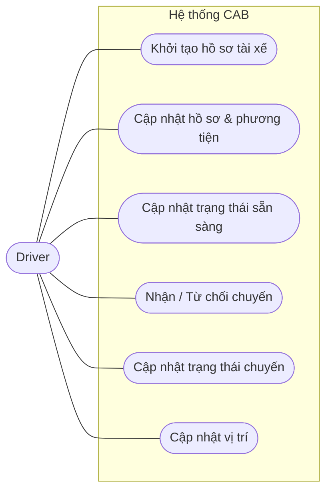
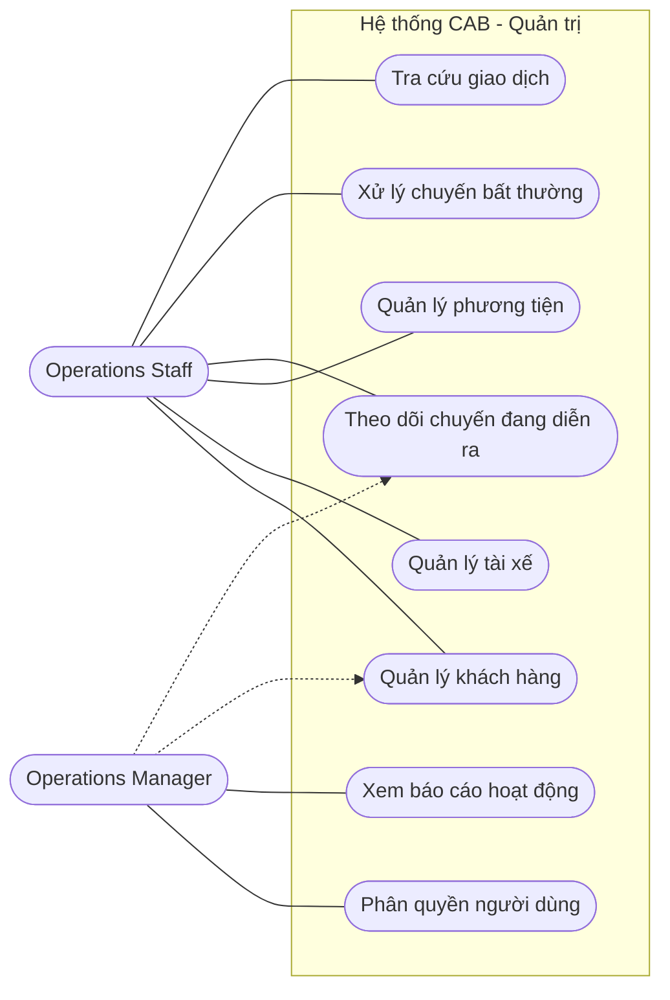
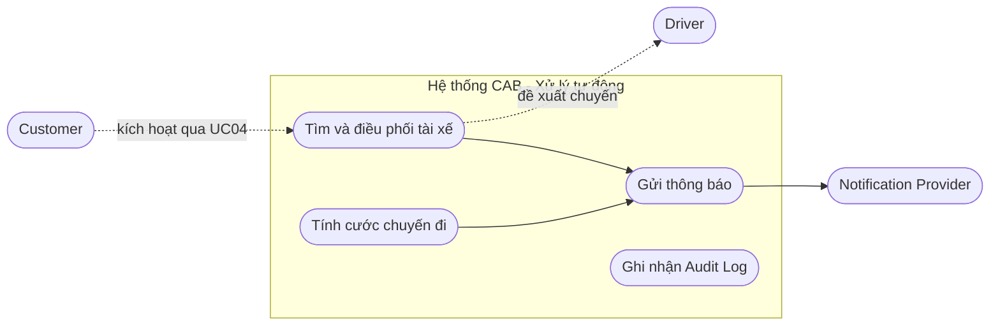

### Bước 1: phân tích ngữ cảnh bussines context, bussines problem
- Bussines context: 
  Công ty ABC là doanh nghiệp cung cấp dịch vụ đặt xe trực tuyến (CAB).
  Hiện tại, khách hàng có thể đặt xe thông qua:
    - Tổng đài.
    - Ứng dụng đơn giản hiện có.
  Tuy nhiên, hệ thống hiện tại chưa đáp ứng tốt khi quy mô khách hàng và tài xế tăng lên. Việc      phân công tài xế còn phụ thuộc nhiều vào thao tác thủ công, khách hàng khó theo dõi trạng thái    chuyến đi và thông tin thanh toán chưa được quản lý tập trung.
  Doanh nghiệp mong muốn xây dựng một nền tảng CAB mới có khả năng phục vụ số lượng lớn khách       hàng và tài xế, đồng thời có kiến trúc linh hoạt để có thể mở rộng thêm các tính năng và dịch     vụ trongtương lai.

- Bussines problem:
ABC cần thay thế quy trình đặt xe và điều phối thủ công bằng một nền tảng CAB tập trung, có khả năng:
- Tự động hóa việc tìm kiếm và điều phối tài xế.
- Quản lý toàn bộ vòng đời của chuyến đi.
- Hỗ trợ tính cước và thanh toán.
- Cung cấp hệ thống thông báo cho khách hàng và tài xế.
- Hỗ trợ nhân viên vận hành theo dõi và xử lý các chuyến đi.
- Quản lý tập trung thông tin khách hàng, tài xế, phương tiện và giao dịch.
- Cung cấp báo cáo phục vụ quản lý và ra quyết định.
- Đảm bảo hệ thống hoạt động ổn định khi số lượng người dùng tăng cao.
- Có khả năng mở rộng thêm dịch vụ và tích hợp mới trong tương lai.

- Khách hàng muốn giải quyết các vấn đề chính sau:
1. **Giảm việc điều phối tài xế thủ công**
   - Tự động tìm tài xế phù hợp và gần khách hàng.
   - Tự động chuyển yêu cầu sang tài xế khác nếu tài xế được đề xuất từ chối hoặc không phản hồi.
2. **Cải thiện trải nghiệm đặt xe**
   - Khách hàng có thể đặt xe trực tuyến.
   - Khách hàng biết được trạng thái yêu cầu đặt xe.
   - Khách hàng có thể theo dõi tài xế và chuyến đi.
3. **Quản lý thanh toán tập trung**
   - Hỗ trợ thanh toán tiền mặt và thanh toán điện tử.
   - Tích hợp với nhà cung cấp thanh toán bên ngoài.
   - Không lưu trực tiếp thông tin nhạy cảm của thẻ hoặc tài khoản thanh toán.
4. **Cải thiện việc quản lý và vận hành**
   - Nhân viên có thể theo dõi các chuyến đang diễn ra.
   - Quản lý khách hàng, tài xế và phương tiện.
   - Xử lý các trường hợp chuyến bị lỗi hoặc phát sinh vấn đề.
5. **Cải thiện khả năng quản lý dữ liệu**
   - Quản lý tập trung lịch sử chuyến đi và giao dịch.
   - Cung cấp báo cáo về số lượng chuyến, doanh thu, tỷ lệ hoàn thành, tỷ lệ hủy và hiệu quả tài xế.
6. **Đảm bảo khả năng mở rộng**
   - Hệ thống có thể phục vụ số lượng lớn khách hàng và tài xế.
   - Có thể bổ sung dịch vụ, phương thức thanh toán và nhà cung cấp thông báo mới trong tương lai.
  
- Hệ thống CAB có 3 nhóm người dùng chính:

| Nhóm người dùng | Đối tượng | Mục đích sử dụng |
|---|---|---|
| **Khách hàng** | Người có nhu cầu đặt xe | Đăng ký, đăng nhập, đặt xe, theo dõi chuyến, thanh toán, xem lịch sử và đánh giá tài xế. |
| **Tài xế** | Tài xế của ABC | Quản lý hồ sơ, phương tiện, trạng thái hoạt động, nhận chuyến và cập nhật trạng thái chuyến. |
| **Nhân viên vận hành** | Operations Staff / Operations Manager | Quản lý khách hàng, tài xế, phương tiện, theo dõi chuyến, xử lý sự cố và giám sát hoạt động. |

Các bên liên quan hỗ trợ hệ thống

Ngoài 3 nhóm người dùng chính, hệ thống còn tương tác với:

- **Ban giám đốc:** Theo dõi báo cáo, doanh thu và hiệu quả hoạt động.
- **Finance / Accounting:** Theo dõi giao dịch, doanh thu và đối soát thanh toán.
- **System Administrator:** Quản trị tài khoản, hệ thống và phân quyền.
- **Payment Provider:** Xử lý thanh toán điện tử.
- **Notification Provider:** Cung cấp các kênh gửi thông báo như SMS, Email hoặc Push Notification.
- **IT / Development Team:** Xây dựng, triển khai và bảo trì hệ thống.
  

### Bước 2: Xác định stakeholder trong hệ thống, những bên liên quan trong hệ thống
lập bảng
| STT | Stakeholder | Vai trò |
|-----|-------------|---------|
| 1 | Ban giám đốc | Định hướng mục tiêu, phê duyệt ngân sách và phạm vi dự án |
| 2 | Operations Manager | Quản lý vận hành, điều phối tài xế và giám sát chuyến |
| 3 | Operations Staff | Quản lý khách hàng, tài xế, phương tiện và chuyến đi |
| 4 | Customer | Đặt xe, theo dõi chuyến, thanh toán và đánh giá tài xế |
| 5 | Driver | Nhận chuyến, thực hiện chuyến và cập nhật trạng thái |
| 6 | Finance / Accounting | Quản lý doanh thu, thanh toán và đối soát |
| 7 | System Administrator | Quản trị tài khoản, phân quyền và cấu hình hệ thống |
| 8 | Payment Provider | Xử lý thanh toán điện tử |
| 9 | Notification Provider | Gửi thông báo SMS, Email, Push Notification |
| 10 | IT / Development Team | Xây dựng, triển khai và bảo trì hệ thống |
| 11 | Security / Compliance | Kiểm soát bảo mật và tuân thủ |
| 12 | Customer Support | Hỗ trợ khách hàng và xử lý khiếu nại |

Ma trận
```
                    MA TRẬN MỨC ĐỘ ẢNH HƯỞNG STAKEHOLDER

                         MỨC ĐỘ QUAN TÂM
                   THẤP                 CAO
                     │                    │
                     │                    │
          ┌──────────┼────────────────────┐
          │          │                    │
          │   KEEP   │   MANAGE CLOSELY   │
          │ SATISFIED│                    │
          │          │ • Ban giám đốc     │
          │ • Finance│ • Operations       │
          │ • Security│   Manager         │
          │ • Compliance│                 │
  ẢNH     │          │                    │
  HƯỞNG ──┼──────────┼────────────────────┤
  CAO     │          │                    │
          │  MONITOR │   KEEP INFORMED    │
          │          │                    │
          │ • Payment│ • Customer         │
          │   Provider│ • Driver          │
          │ • Notification│ • Operations  │
          │   Provider│   Staff           │
          │          │ • Customer Support  │
          │          │ • IT/Development    │
          │          │   Team              │
          └──────────┼────────────────────┘
                     │
                     │
                    THẤP
```


### Bước 3: Bussines goals
| ID | Business Goal | Mô tả |
|---|---|---|
| **BG01** | **Hỗ trợ thanh toán** | Hỗ trợ khách hàng thanh toán bằng tiền mặt và phương thức thanh toán điện tử/chuyển khoản. |
| **BG02** | **Tự động tìm tài xế** | Cho phép hệ thống tự động tìm tài xế phù hợp dựa trên vị trí, trạng thái sẵn sàng và các tiêu chí vận hành. |
| **BG03** | **Tự động điều phối tài xế** | Tự động gửi yêu cầu đến tài xế phù hợp. Nếu tài xế từ chối hoặc không phản hồi, hệ thống tiếp tục tìm tài xế khác. |
| **BG04** | **Quản lý vòng đời chuyến đi** | Quản lý toàn bộ quá trình từ khi khách hàng đặt xe, tìm tài xế, nhận chuyến, đón khách, thực hiện chuyến đến khi hoàn thành hoặc hủy. |
| **BG05** | **Theo dõi chuyến đi** | Cho phép khách hàng và nhân viên vận hành theo dõi trạng thái chuyến và thông tin tài xế. |
| **BG06** | **Quản lý khách hàng, tài xế và phương tiện** | Quản lý tập trung thông tin khách hàng, hồ sơ tài xế, phương tiện, trạng thái hoạt động và vị trí tài xế. |
| **BG07** | **Tính cước và quản lý doanh thu** | Tự động xác định cước chuyến đi và cung cấp dữ liệu phục vụ quản lý doanh thu, giao dịch và đối soát. |
| **BG08** | **Hỗ trợ thông báo** | Gửi thông báo cho khách hàng và tài xế về các sự kiện quan trọng trong quá trình đặt và thực hiện chuyến. |
| **BG09** | **Hỗ trợ vận hành và báo cáo** | Cung cấp giao diện quản trị, giám sát chuyến đi và các báo cáo về số lượng chuyến, doanh thu, tỷ lệ hoàn thành, tỷ lệ hủy và hiệu quả tài xế. |
| **BG10** | **Đảm bảo bảo mật và phân quyền** | Xác thực người dùng, kiểm soát quyền truy cập và bảo vệ dữ liệu cá nhân, phương tiện, vị trí và giao dịch. |
| **BG11** | **Đảm bảo khả năng mở rộng và ổn định** | Hệ thống có khả năng phục vụ số lượng lớn khách hàng, tài xế và duy trì hoạt động khi tải tăng cao. |
| **BG12** | **Hỗ trợ mở rộng trong tương lai** | Cho phép bổ sung dịch vụ mới, phương thức thanh toán, nhà cung cấp thông báo và thay đổi thành phần kỹ thuật mà không phải xây dựng lại toàn bộ hệ thống. |

### Bước 4: Scope
4.1. In Scope – Những chức năng thuộc phạm vi dự án

| STT | Phạm vi | Mô tả |
|---:|---|---|
| **1** | **Quản lý khách hàng** | Đăng ký, đăng nhập, cập nhật thông tin cá nhân và quản lý tài khoản khách hàng. |
| **2** | **Quản lý tài xế** | Quản lý hồ sơ tài xế, trạng thái hoạt động và thông tin liên quan đến tài xế. |
| **3** | **Quản lý phương tiện** | Quản lý thông tin phương tiện và liên kết phương tiện với tài xế. |
| **4** | **Đặt chuyến** | Khách hàng nhập điểm đón, điểm đến, lựa chọn loại xe/dịch vụ và gửi yêu cầu đặt chuyến. |
| **5** | **Tìm và điều phối tài xế** | Hệ thống tự động tìm tài xế phù hợp dựa trên vị trí, trạng thái sẵn sàng và các tiêu chí vận hành. |
| **6** | **Theo dõi chuyến đi** | Khách hàng theo dõi trạng thái chuyến và thông tin vị trí tài xế trong quá trình thực hiện chuyến. |
| **7** | **Quản lý trạng thái chuyến** | Tài xế cập nhật các trạng thái như đã đến điểm đón, đã đón khách, đang di chuyển và hoàn thành chuyến. |
| **8** | **Tính cước** | Hệ thống xác định số tiền khách hàng phải trả dựa trên chính sách tính cước của doanh nghiệp. |
| **9** | **Thanh toán** | Hỗ trợ thanh toán tiền mặt và thanh toán điện tử thông qua nhà cung cấp thanh toán bên ngoài. |
| **10** | **Thông báo** | Gửi thông báo cho khách hàng và tài xế về các sự kiện quan trọng của chuyến đi và thanh toán. |
| **11** | **Lịch sử chuyến đi** | Khách hàng có thể xem lịch sử các chuyến đã thực hiện và thông tin liên quan. |
| **12** | **Đánh giá tài xế** | Khách hàng có thể đánh giá tài xế sau khi hoàn thành chuyến đi. |
| **13** | **Quản lý vận hành** | Nhân viên vận hành theo dõi chuyến đang diễn ra, trạng thái tài xế và xử lý các trường hợp bất thường. |
| **14** | **Quản lý giao dịch** | Tra cứu lịch sử giao dịch, trạng thái thanh toán và hỗ trợ đối soát. |
| **15** | **Phân quyền** | Kiểm soát quyền truy cập của các nhóm người dùng và nhân viên vận hành. |
| **16** | **Báo cáo** | Cung cấp báo cáo về số lượng chuyến, doanh thu, tỷ lệ hoàn thành, tỷ lệ hủy và hiệu quả tài xế. |
| **17** | **Bảo mật và audit** | Bảo vệ dữ liệu người dùng, dữ liệu vị trí, dữ liệu giao dịch và ghi nhận các thao tác quan trọng. |

---
4.2. Out of Scope – Những chức năng chưa thuộc phạm vi

| STT | Chức năng | Lý do / Ghi chú |
|---:|---|---|
| **1** | **AI dự báo nhu cầu đặt xe** | Đề bài chưa yêu cầu. Nếu muốn triển khai cần đánh giá thêm dữ liệu, chi phí và tính khả thi với khách hàng. |
| **2** | **AI dự đoán nhu cầu theo thời gian/khu vực** | Chưa thuộc yêu cầu hiện tại. Cần xác nhận với khách hàng nếu muốn đưa vào phạm vi. |
| **3** | **AI tự động dự báo giá cước** | Chính sách tính cước chưa được khách hàng xác định nên chưa đưa vào phạm vi. |
| **4** | **Tìm đường đi ngắn nhất** | Đề bài yêu cầu tìm tài xế dựa trên vị trí nhưng chưa yêu cầu hệ thống tự xây dựng thuật toán tìm đường. Cần xác nhận có sử dụng dịch vụ bản đồ bên ngoài hay không. |
| **5** | **Xây dựng hệ thống bản đồ riêng** | Không nằm trong phạm vi hiện tại. Có thể tích hợp với bên thứ ba nếu cần. |
| **6** | **Xây dựng hệ thống thanh toán riêng** | Hệ thống chỉ tích hợp Payment Provider bên ngoài, không tự xây dựng cổng thanh toán. |
| **7** | **Lưu thông tin thẻ/tài khoản thanh toán** | Không lưu trực tiếp dữ liệu thanh toán nhạy cảm trong hệ thống CAB. |
| **8** | **Marketing và quảng cáo** | Không thuộc quy trình vận hành đặt xe được mô tả trong đề bài. |
| **9** | **Quản lý nhân sự và tiền lương tài xế** | Không được đề cập trong yêu cầu hiện tại. |
| **10** | **Quản lý bảo dưỡng phương tiện** | Chưa được đề cập trong phạm vi nghiệp vụ hiện tại. |
| **11** | **Hệ thống loyalty/điểm thưởng** | Chưa có yêu cầu về chương trình khách hàng thân thiết. |
| **12** | **Chat trực tiếp giữa khách hàng và tài xế** | Chưa được đề cập trong yêu cầu hiện tại. Cần xác nhận với khách hàng nếu muốn bổ sung. |
| **13** | **Dịch vụ giao hàng** | Hiện tại hệ thống tập trung vào dịch vụ đặt xe; các loại dịch vụ mới cần được xác nhận ở giai đoạn mở rộng. |

---
4.3. Các nội dung cần xác nhận với khách hàng

Một số chức năng có thể liên quan đến hệ thống nhưng **chưa đủ thông tin để xác định có thuộc Scope hay không**.

| ID | Nội dung cần xác nhận | Câu hỏi dành cho khách hàng |
|---|---|---|
| **SCOPE01** | Tìm đường đi | Hệ thống có cần tự tính tuyến đường hay chỉ sử dụng API của nhà cung cấp bản đồ? |
| **SCOPE02** | AI dự báo nhu cầu | Khách hàng có yêu cầu sử dụng AI để dự báo nhu cầu đặt xe trong tương lai không? |
| **SCOPE03** | AI điều phối tài xế | Việc lựa chọn tài xế chỉ dựa trên các rule cố định hay cần sử dụng AI/ML? |
| **SCOPE04** | Giá cước động | Có áp dụng giá cước thay đổi theo thời gian, khu vực hoặc nhu cầu hay không? |
| **SCOPE05** | Chat khách hàng – tài xế | Có cần chức năng nhắn tin trực tiếp giữa khách hàng và tài xế không? |
| **SCOPE06** | Loyalty | Có cần chương trình điểm thưởng, voucher hoặc khách hàng thân thiết không? |
| **SCOPE07** | Bảo dưỡng phương tiện | Có cần quản lý lịch bảo dưỡng, đăng kiểm và tình trạng phương tiện không? |
| **SCOPE08** | Dịch vụ mới | Trong giai đoạn hiện tại có triển khai thêm dịch vụ ngoài đặt xe hay chỉ thiết kế kiến trúc để mở rộng sau này? |

---
4.4. Scope Summary
In Scope

Hệ thống CAB trong phạm vi dự án tập trung vào:

**Quản lý khách hàng → Quản lý tài xế → Quản lý phương tiện → Đặt chuyến → Tìm/điều phối tài xế → Thực hiện chuyến → Tính cước → Thanh toán → Thông báo → Đánh giá → Quản lý vận hành → Báo cáo.**

### Out of Scope

Các chức năng như **AI dự báo nhu cầu, AI tối ưu điều phối, tự xây dựng hệ thống tìm đường, xây dựng Payment Gateway riêng, Marketing, Loyalty, quản lý nhân sự và bảo dưỡng phương tiện** chưa thuộc phạm vi hiện tại và cần được xác nhận riêng với khách hàng.

> **Lưu ý:** Out of Scope không có nghĩa là "không bao giờ làm". Đây là những chức năng **không nằm trong phạm vi triển khai hiện tại** hoặc **chưa đủ thông tin để cam kết**, có thể xem xét ở các phase sau.

### Bước 5: Bussines requirment
| Mã | Tên Business Requirement | Diễn giải |
|---|---|---|
| **BR01** | **Cho phép đặt chuyến** | Hệ thống cho phép khách hàng nhập điểm đón, điểm đến, lựa chọn loại xe/dịch vụ và gửi yêu cầu đặt chuyến. |
| **BR02** | **Tìm tài xế tự động** | Hệ thống tự động tìm tài xế phù hợp dựa trên vị trí, trạng thái sẵn sàng và các tiêu chí vận hành được doanh nghiệp quy định. |
| **BR03** | **Theo dõi chuyến đi** | Khách hàng có khả năng theo dõi chuyến đi trong suốt quá trình di chuyển, bao gồm trạng thái chuyến và thông tin liên quan đến tài xế. |
| **BR04** | **Hỗ trợ thanh toán** | Hệ thống hỗ trợ khách hàng thanh toán bằng tiền mặt hoặc phương thức thanh toán điện tử thông qua nhà cung cấp thanh toán bên ngoài. |
| **BR05** | **Tính cước chuyến đi** | Hệ thống xác định số tiền khách hàng phải thanh toán dựa trên loại dịch vụ và thông tin của chuyến đi theo chính sách tính cước của doanh nghiệp. |
| **BR06** | **Quản lý tài khoản khách hàng** | Hệ thống cho phép khách hàng đăng ký, đăng nhập và cập nhật thông tin cá nhân. |
| **BR07** | **Quản lý tài xế** | Hệ thống cho phép quản lý hồ sơ tài xế, thông tin phương tiện và trạng thái hoạt động của tài xế. |
| **BR08** | **Nhận và xử lý chuyến** | Hệ thống cho phép tài xế nhận hoặc từ chối chuyến; nếu tài xế không nhận hoặc không phản hồi, hệ thống tiếp tục tìm tài xế khác. |
| **BR09** | **Cập nhật trạng thái chuyến** | Hệ thống cho phép tài xế cập nhật các trạng thái như đã đến điểm đón, đã đón khách, đang di chuyển và hoàn thành chuyến. |
| **BR10** | **Quản lý vị trí tài xế** | Hệ thống lưu và cập nhật thông tin vị trí của tài xế để hỗ trợ tìm tài xế phù hợp và dự kiến thời gian tài xế đến. |
| **BR11** | **Thông báo chuyến đi** | Hệ thống gửi thông báo cho khách hàng và tài xế khi xảy ra các sự kiện quan trọng trong chuyến đi. |
| **BR12** | **Quản lý lịch sử chuyến đi** | Hệ thống cho phép khách hàng xem lịch sử các chuyến đã thực hiện và thông tin liên quan. |
| **BR13** | **Đánh giá tài xế** | Hệ thống cho phép khách hàng đánh giá tài xế sau khi chuyến đi hoàn thành. |
| **BR14** | **Quản lý vận hành** | Hệ thống cung cấp giao diện cho nhân viên vận hành quản lý khách hàng, tài xế, phương tiện và theo dõi các chuyến đang diễn ra. |
| **BR15** | **Xử lý chuyến bất thường** | Hệ thống hỗ trợ nhân viên vận hành kiểm tra và xử lý các trường hợp chuyến bị lỗi hoặc phát sinh vấn đề. |
| **BR16** | **Quản lý giao dịch** | Hệ thống cho phép tra cứu thông tin giao dịch và hỗ trợ đối soát thanh toán. |
| **BR17** | **Phân quyền người dùng** | Hệ thống kiểm soát quyền truy cập theo vai trò, đảm bảo các thao tác nhạy cảm chỉ được thực hiện bởi người có quyền. |
| **BR18** | **Báo cáo hoạt động** | Hệ thống cung cấp báo cáo về số lượng chuyến, doanh thu, tỷ lệ hoàn thành, tỷ lệ hủy và hiệu quả tài xế. |
| **BR19** | **Bảo vệ dữ liệu** | Hệ thống bảo vệ thông tin cá nhân, thông tin phương tiện, dữ liệu vị trí và dữ liệu giao dịch. |
| **BR20** | **Ghi nhận lịch sử thao tác** | Hệ thống lưu vết các thao tác quan trọng để phục vụ kiểm tra, truy vết và xử lý sự cố. |
| **BR21** | **Xử lý thanh toán thất bại** | Khi thanh toán điện tử thất bại, hệ thống thông báo cho khách hàng và cho phép xử lý lại theo chính sách doanh nghiệp. |
| **BR22** | **Xử lý không tìm được tài xế** | Nếu không tìm được tài xế phù hợp, hệ thống thông báo rõ ràng cho khách hàng và cập nhật trạng thái yêu cầu. |
| **BR23** | **Khả năng mở rộng hệ thống** | Hệ thống có khả năng mở rộng khi số lượng khách hàng, tài xế và chuyến đi tăng cao. |
| **BR24** | **Hỗ trợ mở rộng dịch vụ** | Hệ thống cho phép bổ sung loại dịch vụ, phương thức thanh toán và nhà cung cấp mới mà hạn chế thay đổi hệ thống hiện tại. |

### Bước 6: Bussines process, dùng công cụ mermaid 
6.1. Quy trình đặt xe và thực hiện chuyến



6.2. Quy trình quản lý và vận hành



6.3. Quy trình tìm và phân công tài xế



6.4. Quy trình thanh toán



### Bước 7: Functional requirment 
| Mã | Tên Functional Requirement | Diễn giải |
|---|---|---|
| **FR01** | Đăng ký tài khoản | Hệ thống cho phép khách hàng đăng ký tài khoản bằng cách cung cấp các thông tin cần thiết. |
| **FR02** | Đăng nhập | Hệ thống cho phép khách hàng và tài xế đăng nhập bằng thông tin xác thực hợp lệ. |
| **FR03** | Cập nhật thông tin cá nhân | Hệ thống cho phép khách hàng cập nhật thông tin cá nhân của mình. |
| **FR04** | Nhập thông tin chuyến đi | Hệ thống cho phép khách hàng nhập điểm đón, điểm đến và lựa chọn loại xe/dịch vụ. |
| **FR05** | Tạo yêu cầu đặt chuyến | Hệ thống cho phép khách hàng gửi yêu cầu đặt chuyến sau khi thông tin chuyến hợp lệ. |
| **FR06** | Tìm tài xế phù hợp | Hệ thống tự động xác định các tài xế phù hợp dựa trên vị trí, trạng thái sẵn sàng và tiêu chí vận hành. |
| **FR07** | Gửi yêu cầu đến tài xế | Hệ thống gửi thông tin chuyến đến tài xế phù hợp để tài xế chấp nhận hoặc từ chối chuyến. |
| **FR08** | Tìm tài xế tiếp theo | Khi tài xế từ chối hoặc không phản hồi, hệ thống tiếp tục tìm và gửi yêu cầu đến tài xế khác. |
| **FR09** | Thông báo không tìm được tài xế | Khi không tìm được tài xế phù hợp, hệ thống thông báo rõ ràng cho khách hàng. |
| **FR10** | Cập nhật vị trí tài xế | Hệ thống tiếp nhận và lưu thông tin vị trí hiện tại của tài xế. |
| **FR11** | Theo dõi vị trí tài xế | Hệ thống cho phép khách hàng theo dõi vị trí tài xế và thời gian dự kiến tài xế đến. |
| **FR12** | Cập nhật trạng thái chuyến | Hệ thống cho phép tài xế cập nhật trạng thái chuyến đi. |
| **FR13** | Tính cước chuyến đi | Hệ thống xác định số tiền khách hàng phải trả dựa trên loại dịch vụ và thông tin chuyến đi. |
| **FR14** | Thanh toán tiền mặt | Hệ thống cho phép ghi nhận và cập nhật trạng thái thanh toán bằng tiền mặt. |
| **FR15** | Thanh toán điện tử | Hệ thống tích hợp với nhà cung cấp thanh toán bên ngoài để xử lý giao dịch điện tử. |
| **FR16** | Xử lý thanh toán thất bại | Hệ thống thông báo cho khách hàng khi thanh toán thất bại và cho phép xử lý lại theo chính sách doanh nghiệp. |
| **FR17** | Gửi thông báo cho khách hàng | Hệ thống gửi thông báo về các sự kiện quan trọng của chuyến đi và thanh toán. |
| **FR18** | Gửi thông báo cho tài xế | Hệ thống gửi thông báo cho tài xế khi có chuyến mới hoặc thay đổi liên quan đến chuyến. |
| **FR19** | Xem lịch sử chuyến đi | Hệ thống cho phép khách hàng xem danh sách và thông tin các chuyến đã thực hiện. |
| **FR20** | Đánh giá tài xế | Hệ thống cho phép khách hàng đánh giá tài xế sau khi chuyến đi hoàn thành. |
| **FR21** | Quản lý hồ sơ tài xế | Hệ thống cho phép tạo, xem và cập nhật thông tin hồ sơ tài xế. |
| **FR22** | Quản lý phương tiện | Hệ thống cho phép quản lý thông tin phương tiện của tài xế. |
| **FR23** | Cập nhật trạng thái tài xế | Hệ thống cho phép tài xế chuyển trạng thái sẵn sàng hoặc không sẵn sàng nhận chuyến. |
| **FR24** | Quản lý khách hàng | Nhân viên vận hành có thể tra cứu và quản lý thông tin khách hàng theo quyền được cấp. |
| **FR25** | Quản lý tài xế | Nhân viên vận hành có thể tạo, cập nhật, xem và quản lý trạng thái tài xế. |
| **FR26** | Quản lý phương tiện | Nhân viên vận hành có thể xem và cập nhật thông tin phương tiện. |
| **FR27** | Theo dõi chuyến đang diễn ra | Nhân viên vận hành có thể xem danh sách và trạng thái các chuyến đang thực hiện. |
| **FR28** | Xử lý chuyến bất thường | Nhân viên vận hành có thể kiểm tra và xử lý các trường hợp chuyến bị lỗi hoặc phát sinh vấn đề. |
| **FR29** | Tra cứu giao dịch | Người có quyền có thể tra cứu lịch sử giao dịch và trạng thái thanh toán. |
| **FR30** | Phân quyền người dùng | Hệ thống phân quyền theo vai trò và kiểm tra quyền trước khi thực hiện các thao tác quản trị. |
| **FR31** | Xem báo cáo hoạt động | Hệ thống cung cấp báo cáo về số lượng chuyến, doanh thu, tỷ lệ hoàn thành, tỷ lệ hủy và hiệu quả tài xế. |
| **FR32** | Ghi nhận lịch sử thao tác | Hệ thống lưu vết các thao tác quan trọng để phục vụ kiểm tra và truy vết khi xảy ra sự cố. |

### Bước 8: Bussines Rules và Exceptions
8.1. Business Rules

| Mã | Business Rule | Diễn giải |
|---|---|---|
| **BRL01** | Khách hàng phải đăng nhập | Khách hàng phải đăng nhập trước khi thực hiện các chức năng yêu cầu tài khoản như đặt xe, xem lịch sử chuyến và đánh giá tài xế. |
| **BRL02** | Tài xế phải ở trạng thái sẵn sàng | Chỉ những tài xế đang ở trạng thái sẵn sàng nhận chuyến mới được hệ thống đưa vào danh sách tìm kiếm tài xế. |
| **BRL03** | Tài xế phải phù hợp với chuyến | Tài xế được đề xuất phải đáp ứng các tiêu chí về vị trí, trạng thái hoạt động, loại phương tiện và các điều kiện vận hành khác. |
| **BRL04** | Tài xế có quyền chấp nhận hoặc từ chối chuyến | Khi nhận được yêu cầu chuyến, tài xế có thể chấp nhận hoặc từ chối yêu cầu. |
| **BRL05** | Tự động tìm tài xế tiếp theo | Nếu tài xế từ chối hoặc không phản hồi trong thời gian quy định, hệ thống phải tiếp tục tìm tài xế phù hợp khác. |
| **BRL06** | Một chuyến chỉ có một tài xế | Một yêu cầu đặt chuyến chỉ được gán cho một tài xế tại một thời điểm. |
| **BRL07** | Không tìm được tài xế | Nếu không còn tài xế phù hợp, hệ thống phải cập nhật trạng thái yêu cầu và thông báo cho khách hàng. |
| **BRL08** | Tài xế phải cập nhật trạng thái chuyến | Tài xế phải cập nhật trạng thái theo trình tự: đã đến điểm đón → đã đón khách → đang di chuyển → hoàn thành chuyến. |
| **BRL09** | Chỉ được hoàn thành chuyến hợp lệ | Chuyến chỉ được chuyển sang trạng thái hoàn thành khi tài xế đã thực hiện chuyến theo quy trình nghiệp vụ. |
| **BRL10** | Tính cước sau khi chuyến hoàn thành | Hệ thống xác định số tiền khách hàng phải trả dựa trên thông tin chuyến và chính sách tính cước của doanh nghiệp. |
| **BRL11** | Hỗ trợ nhiều phương thức thanh toán | Khách hàng có thể thanh toán bằng tiền mặt hoặc phương thức thanh toán điện tử được hệ thống hỗ trợ. |
| **BRL12** | Không lưu thông tin thanh toán nhạy cảm | Hệ thống CAB không lưu trực tiếp thông tin nhạy cảm của thẻ hoặc tài khoản thanh toán; việc xử lý được thực hiện thông qua Payment Provider. |
| **BRL13** | Xử lý thanh toán thất bại | Khi thanh toán điện tử thất bại, hệ thống phải ghi nhận trạng thái thất bại và thông báo cho khách hàng. |
| **BRL14** | Chỉ đánh giá sau khi hoàn thành chuyến | Khách hàng chỉ được đánh giá tài xế sau khi chuyến đi đã hoàn thành. |
| **BRL15** | Phân quyền quản trị | Nhân viên chỉ được thực hiện các chức năng phù hợp với quyền được cấp. |
| **BRL16** | Ghi nhận thao tác quan trọng | Các thao tác quản trị và thao tác quan trọng phải được ghi nhận để phục vụ kiểm tra và truy vết. |
| **BRL17** | Gửi thông báo theo sự kiện | Hệ thống phải gửi thông báo khi xảy ra các sự kiện quan trọng của chuyến đi và thanh toán. |
| **BRL18** | Không cho phép tài xế nhận nhiều chuyến xung đột | Tài xế đang thực hiện một chuyến không được đồng thời nhận một chuyến khác nếu hai chuyến có thời gian thực hiện bị trùng. |
| **BRL19** | Vị trí tài xế phục vụ điều phối | Thông tin vị trí tài xế được sử dụng để hỗ trợ tìm tài xế phù hợp và ước tính thời gian đến. |
| **BRL20** | Dữ liệu người dùng phải được bảo vệ | Thông tin cá nhân, thông tin phương tiện, dữ liệu vị trí và dữ liệu giao dịch phải được bảo vệ theo chính sách bảo mật của doanh nghiệp. |

---

8.2. Exceptions
| Mã | Exception | Điều kiện xảy ra | Cách xử lý |
|---|---|---|---|
| **EX01** | Không tìm được tài xế | Không có tài xế phù hợp hoặc tất cả tài xế đều từ chối/không phản hồi. | Hệ thống thông báo cho khách hàng rằng chưa tìm được tài xế và cập nhật trạng thái yêu cầu. |
| **EX02** | Tài xế từ chối chuyến | Tài xế nhận được yêu cầu nhưng chọn từ chối. | Hệ thống ghi nhận việc từ chối và tiếp tục tìm tài xế khác. |
| **EX03** | Tài xế không phản hồi | Tài xế không phản hồi trong thời gian quy định. | Hệ thống coi yêu cầu là hết thời gian phản hồi và chuyển sang tài xế khác. |
| **EX04** | Mất kết nối mạng của khách hàng | Khách hàng mất kết nối trong quá trình đặt hoặc theo dõi chuyến. | Hệ thống vẫn duy trì trạng thái chuyến ở phía server; ứng dụng cập nhật lại dữ liệu khi kết nối được khôi phục. |
| **EX05** | Mất kết nối mạng của tài xế | Tài xế mất kết nối trong quá trình thực hiện chuyến. | Hệ thống ghi nhận thời điểm mất kết nối và hiển thị trạng thái phù hợp cho nhân viên vận hành; xử lý tiếp theo theo chính sách doanh nghiệp. |
| **EX06** | Thanh toán điện tử thất bại | Payment Provider trả về kết quả giao dịch thất bại. | Hệ thống thông báo cho khách hàng và cho phép thực hiện lại thanh toán theo chính sách. |
| **EX07** | Payment Provider không phản hồi | Hệ thống không nhận được kết quả từ nhà cung cấp thanh toán. | Giao dịch được đưa vào trạng thái chờ xử lý/đối soát và không làm dừng chức năng đặt xe. |
| **EX08** | Notification Provider lỗi | Nhà cung cấp SMS, Email hoặc Push Notification không hoạt động. | Hệ thống ghi nhận lỗi, có thể thử lại hoặc chuyển sang kênh thông báo khác nếu được cấu hình. |
| **EX09** | Tài xế không cập nhật trạng thái | Tài xế không cập nhật trạng thái chuyến đúng thời điểm. | Hệ thống ghi nhận trạng thái hiện tại và cảnh báo/hiển thị cho nhân viên vận hành để xử lý. |
| **EX10** | Hủy chuyến | Khách hàng hoặc tài xế yêu cầu hủy chuyến theo điều kiện được phép. | Hệ thống kiểm tra chính sách hủy, cập nhật trạng thái chuyến và xử lý phí hủy nếu có. |
| **EX11** | Không thể xác định vị trí tài xế | GPS hoặc dịch vụ vị trí không cung cấp được vị trí hợp lệ. | Hệ thống thông báo trạng thái vị trí không khả dụng và cho phép vận hành tiếp tục xử lý theo chính sách. |
| **EX12** | Lỗi hệ thống | Một thành phần như thanh toán, thông báo hoặc dịch vụ tìm tài xế gặp lỗi. | Hệ thống cô lập lỗi, ghi log và đảm bảo các chức năng khác tiếp tục hoạt động nếu có thể. |
| **EX13** | Tài xế mất trạng thái sẵn sàng | Tài xế chuyển sang không sẵn sàng trong khi đang được tìm kiếm. | Hệ thống loại tài xế khỏi danh sách ứng viên và tìm tài xế khác. |
| **EX14** | Chuyến bị lỗi hoặc bất thường | Chuyến có trạng thái không hợp lệ hoặc phát sinh vấn đề trong quá trình thực hiện. | Hệ thống đánh dấu chuyến cần xử lý và cho phép nhân viên vận hành kiểm tra, can thiệp. |

---
8.3. Business Rules cần xác nhận với khách hàng
Một số quy tắc trong đề bài chưa được xác định cụ thể. BA cần làm rõ trước khi phát triển:
| Mã | Nội dung cần xác nhận | Câu hỏi cần làm rõ |
|---|---|---|
| **TBC01** | Thời gian tài xế phản hồi | Tài xế có bao nhiêu giây/phút để chấp nhận hoặc từ chối chuyến? |
| **TBC02** | Tiêu chí ưu tiên tài xế | Ưu tiên theo khoảng cách, thời gian đến, loại xe, rating hay tiêu chí nào khác? |
| **TBC03** | Phạm vi tìm tài xế | Hệ thống tìm tài xế trong bán kính bao nhiêu km? Có mở rộng bán kính nếu không tìm được không? |
| **TBC04** | Cách tính cước | Cước được tính theo quãng đường, thời gian, loại xe, giá cố định hay kết hợp nhiều yếu tố? |
| **TBC05** | Chính sách hủy chuyến | Ai được phép hủy? Có tính phí hủy không? Phí được tính như thế nào? |
| **TBC06** | Thanh toán thất bại | Khách hàng được phép thanh toán lại bao nhiêu lần và trong thời gian bao lâu? |
| **TBC07** | Mất kết nối mạng | Khi khách hàng hoặc tài xế mất mạng, hệ thống xử lý trạng thái chuyến như thế nào? |
| **TBC08** | Lưu trữ dữ liệu | Dữ liệu khách hàng, chuyến đi, vị trí và giao dịch được lưu trong bao lâu? |
| **TBC09** | Quy tắc đánh giá | Khách hàng được đánh giá trong bao lâu sau khi hoàn thành chuyến? Có được sửa/xóa đánh giá không? |
| **TBC10** | Quy tắc xử lý tài xế | Tài xế từ chối nhiều chuyến liên tiếp có bị giới hạn hoặc thay đổi trạng thái không? |

### Bước 9: Mô hình hóa dữ liệu, xác định các thực thể, erd 
9.1. Xác định các thực thể

| Mã | Thực thể | Diễn giải |
|---|---|---|
| **E01** | Customer | Lưu thông tin khách hàng sử dụng dịch vụ đặt xe. |
| **E02** | Driver | Lưu thông tin tài xế và trạng thái hoạt động của tài xế. |
| **E03** | Vehicle | Lưu thông tin phương tiện của tài xế. |
| **E04** | Trip | Lưu thông tin chuyến đi do khách hàng đặt. |
| **E05** | TripStatus | Lưu trạng thái của chuyến đi trong quá trình thực hiện. |
| **E06** | DriverLocation | Lưu thông tin vị trí của tài xế theo thời gian. |
| **E07** | Fare | Lưu thông tin cước phí của chuyến đi. |
| **E08** | Payment | Lưu thông tin giao dịch thanh toán. |
| **E09** | PaymentMethod | Lưu phương thức thanh toán được sử dụng. |
| **E10** | Notification | Lưu thông tin các thông báo được gửi đến khách hàng hoặc tài xế. |
| **E11** | Rating | Lưu thông tin đánh giá của khách hàng dành cho tài xế. |
| **E12** | Staff | Lưu thông tin nhân viên vận hành. |
| **E13** | Role | Lưu thông tin vai trò và quyền của người dùng quản trị. |
| **E14** | AuditLog | Lưu vết các thao tác quan trọng trong hệ thống. |

---
9.2. Các thuộc tính chính

| Thực thể | Thuộc tính chính |
|---|---|
| **Customer** | customer_id, full_name, phone, email, password_hash, status, created_at |
| **Driver** | driver_id, full_name, phone, email, password_hash, status, rating, created_at |
| **Vehicle** | vehicle_id, driver_id, license_plate, vehicle_type, brand, model, status |
| **Trip** | trip_id, customer_id, driver_id, pickup_location, destination, service_type, status, requested_at, started_at, completed_at |
| **TripStatus** | status_id, trip_id, status, created_at |
| **DriverLocation** | location_id, driver_id, latitude, longitude, recorded_at |
| **Fare** | fare_id, trip_id, service_type, distance, duration, amount, calculated_at |
| **Payment** | payment_id, trip_id, payment_method_id, amount, status, transaction_code, paid_at |
| **PaymentMethod** | payment_method_id, method_name, status |
| **Notification** | notification_id, recipient_id, recipient_type, notification_type, title, content, status, sent_at |
| **Rating** | rating_id, trip_id, customer_id, driver_id, score, comment, created_at |
| **Staff** | staff_id, full_name, email, password_hash, role_id, status |
| **Role** | role_id, role_name, description |
| **AuditLog** | log_id, staff_id, action, entity_type, entity_id, created_at |

---
9.3. Mối quan hệ giữa các thực thể

| Quan hệ | Cardinality | Diễn giải |
|---|---|---|
| **Customer – Trip** | 1 : N | Một khách hàng có thể đặt nhiều chuyến; một chuyến thuộc về một khách hàng. |
| **Driver – Trip** | 1 : N | Một tài xế có thể thực hiện nhiều chuyến; một chuyến có tối đa một tài xế được phân công. |
| **Driver – Vehicle** | 1 : N | Một tài xế có thể sử dụng một hoặc nhiều phương tiện theo nghiệp vụ. |
| **Trip – TripStatus** | 1 : N | Một chuyến có nhiều lần thay đổi trạng thái trong quá trình thực hiện. |
| **Driver – DriverLocation** | 1 : N | Một tài xế có nhiều bản ghi vị trí theo thời gian. |
| **Trip – Fare** | 1 : 1 | Mỗi chuyến hoàn thành có một thông tin cước phí được tính. |
| **Trip – Payment** | 1 : N | Một chuyến có thể có nhiều lần giao dịch thanh toán nếu thanh toán thất bại và thực hiện lại. |
| **PaymentMethod – Payment** | 1 : N | Một phương thức thanh toán có thể được sử dụng cho nhiều giao dịch. |
| **Trip – Notification** | 1 : N | Một chuyến có thể phát sinh nhiều thông báo. |
| **Trip – Rating** | 1 : 0..1 | Một chuyến có thể có tối đa một đánh giá từ khách hàng. |
| **Customer – Rating** | 1 : N | Một khách hàng có thể thực hiện nhiều đánh giá. |
| **Driver – Rating** | 1 : N | Một tài xế có thể nhận nhiều đánh giá. |
| **Role – Staff** | 1 : N | Một vai trò có thể được gán cho nhiều nhân viên. |
| **Staff – AuditLog** | 1 : N | Một nhân viên có thể tạo nhiều bản ghi audit log. |

---

9.4. ERD – Entity Relationship Diagram



9.5. Ghi chú mô hình dữ liệu

- **Customer, Driver, Staff** là các nhóm người dùng chính của hệ thống.
- **Trip** là thực thể trung tâm, liên kết với khách hàng, tài xế, trạng thái, cước phí, thanh toán, thông báo và đánh giá.
- **DriverLocation** lưu nhiều vị trí của tài xế theo thời gian để phục vụ việc tìm tài xế và theo dõi chuyến.
- **Payment** được tách khỏi **Trip** để hỗ trợ trường hợp thanh toán thất bại và thanh toán lại.
- Thông tin nhạy cảm của thẻ hoặc tài khoản thanh toán **không được lưu trực tiếp trong CAB**.
- **TripStatus** được tách riêng để lưu lịch sử thay đổi trạng thái thay vì chỉ lưu trạng thái hiện tại của chuyến.
- **AuditLog** phục vụ việc truy vết các thao tác quan trọng của nhân viên vận hành.

### Bước 10: Xác định Non-Functional Requirement (NFR)

| Mã | Nhóm | Yêu cầu | Diễn giải | Liên quan |
|---|---|---|---|---|
| **NFR01** | Performance | Thời gian phản hồi | Các thao tác chính (đặt chuyến, tìm tài xế, cập nhật trạng thái) phải phản hồi trong thời gian ngắn để đảm bảo trải nghiệm người dùng; ngưỡng cụ thể cần xác nhận với khách hàng. | BG02, BR02 |
| **NFR02** | Scalability | Mở rộng độc lập theo thành phần | Các thành phần như đặt chuyến, điều phối tài xế, thanh toán, thông báo phải có khả năng mở rộng (scale) độc lập khi tải tăng, không phụ thuộc lẫn nhau. | BG11, BRL/Kiến trúc |
| **NFR03** | Availability | Cô lập lỗi giữa các thành phần | Lỗi ở chức năng thanh toán hoặc thông báo không được làm gián đoạn chức năng đặt xe và điều phối tài xế. | EX07, EX08, EX12 |
| **NFR04** | Reliability | Không mất yêu cầu khi tài xế từ chối | Khi tài xế từ chối/không phản hồi, hệ thống phải đảm bảo tiếp tục tìm tài xế khác mà không làm mất hoặc trùng lặp yêu cầu của khách hàng. | BR08, BRL05 |
| **NFR05** | Security – Authentication | Xác thực người dùng | Khách hàng, tài xế và nhân viên vận hành phải được xác thực trước khi sử dụng các chức năng yêu cầu tài khoản. | BRL01, BR17 |
| **NFR06** | Security – Authorization | Kiểm soát truy cập theo vai trò | Các thao tác quản trị nhạy cảm chỉ được thực hiện bởi tài khoản có vai trò/quyền phù hợp (RBAC). | BR17, BRL15 |
| **NFR07** | Data Protection | Bảo vệ dữ liệu nhạy cảm | Thông tin cá nhân, thông tin phương tiện, dữ liệu vị trí và dữ liệu giao dịch phải được mã hóa/bảo vệ khi lưu trữ và truyền tải. | BR19, BRL20 |
| **NFR08** | Compliance | Không lưu dữ liệu thanh toán nhạy cảm | Hệ thống CAB không lưu trực tiếp thông tin thẻ/tài khoản thanh toán; việc này do Payment Provider đảm nhiệm (tuân thủ chuẩn bảo mật thanh toán). | BRL12 |
| **NFR09** | Auditability | Ghi vết thao tác quan trọng | Mọi thao tác quản trị và thao tác nhạy cảm phải được ghi log đầy đủ (ai, khi nào, hành động gì) phục vụ truy vết sự cố. | BR20, BRL16 |
| **NFR10** | Maintainability | Triển khai từng phần | Kiến trúc phải cho phép triển khai (deploy) tính năng mới theo từng phần, hạn chế ảnh hưởng đến chức năng đang hoạt động. | BG12 |
| **NFR11** | Extensibility | Mở rộng dịch vụ/thanh toán/thông báo | Kiến trúc phải hỗ trợ bổ sung loại dịch vụ mới, phương thức thanh toán mới và nhà cung cấp thông báo mới mà không cần xây dựng lại toàn bộ hệ thống. | BG12, BR24 |
| **NFR12** | Interoperability | Tích hợp bên thứ ba | Hệ thống phải tích hợp ổn định với Payment Provider, Notification Provider và (nếu xác nhận) dịch vụ bản đồ bên ngoài qua API chuẩn hóa. | SCOPE01, BR04 |
| **NFR13** | Usability | Giao diện thân thiện | Giao diện khách hàng và tài xế phải đơn giản, trực quan, phù hợp thao tác trên thiết bị di động. | BG05 |
| **NFR14** | Observability | Giám sát vận hành thời gian thực | Nhân viên vận hành phải theo dõi được trạng thái chuyến, trạng thái tài xế gần theo thời gian thực để xử lý sự cố kịp thời. | BR15, EX14 |
| **NFR15** | Data Retention | Thời gian lưu trữ dữ liệu | Thời gian lưu trữ dữ liệu chuyến đi, vị trí, giao dịch cần được doanh nghiệp xác nhận, tuân thủ quy định pháp lý liên quan (nếu có). | TBC08 |

> **Lưu ý:** Các ngưỡng định lượng cụ thể (thời gian phản hồi tính bằng giây, SLA uptime, thời gian lưu trữ dữ liệu...) hiện chưa được khách hàng chốt và thuộc nhóm nội dung TBC cần làm rõ trước khi thiết kế chi tiết.

---

### Bước 11: Vẽ Use Case, xác định UC

11.1. Danh sách Actor

| Actor | Loại | Vai trò trong hệ thống |
|---|---|---|
| **Customer** | Primary | Đặt chuyến, theo dõi, thanh toán, đánh giá tài xế |
| **Driver** | Primary | Nhận chuyến, thực hiện chuyến, cập nhật trạng thái/vị trí |
| **Operations Staff** | Primary | Quản lý dữ liệu vận hành, xử lý sự cố chuyến |
| **Operations Manager** | Primary | Phân quyền, xem báo cáo, giám sát vận hành |
| **Payment Provider** | Secondary (External) | Xử lý giao dịch thanh toán điện tử |
| **Notification Provider** | Secondary (External) | Gửi SMS / Email / Push Notification |
| **System (Dispatch/Fare/Notification Engine)** | Supporting | Thực hiện các use case tự động: tìm tài xế, tính cước, gửi thông báo, ghi log |

11.2. Danh sách Use Case

| Mã UC | Tên Use Case | Actor chính | Actor phụ | FR liên quan |
|---|---|---|---|---|
| **UC01** | Đăng ký tài khoản | Customer | — | FR01 |
| **UC02** | Đăng nhập | Customer, Driver, Staff | — | FR02 |
| **UC03** | Cập nhật thông tin cá nhân | Customer | — | FR03 |
| **UC04** | Đặt chuyến | Customer | System | FR04, FR05 |
| **UC05** | Theo dõi chuyến đi | Customer | System | FR11 |
| **UC06** | Xem lịch sử chuyến đi | Customer | — | FR19 |
| **UC07** | Thanh toán chuyến đi | Customer | Payment Provider, System | FR14, FR15, FR16 |
| **UC08** | Đánh giá tài xế | Customer | — | FR20 |
| **UC09** | Khởi tạo hồ sơ tài xế | Driver, Operations Staff | — | FR21 |
| **UC10** | Cập nhật hồ sơ & phương tiện | Driver | — | FR21, FR22 |
| **UC11** | Cập nhật trạng thái sẵn sàng | Driver | — | FR23 |
| **UC12** | Nhận / Từ chối chuyến | Driver | System | FR07 |
| **UC13** | Cập nhật trạng thái chuyến | Driver | System | FR12 |
| **UC14** | Cập nhật vị trí | Driver | System | FR10 |
| **UC15** | Quản lý khách hàng | Operations Staff | — | FR24 |
| **UC16** | Quản lý tài xế | Operations Staff | — | FR25 |
| **UC17** | Quản lý phương tiện | Operations Staff | — | FR26 |
| **UC18** | Theo dõi chuyến đang diễn ra | Operations Staff | — | FR27 |
| **UC19** | Xử lý chuyến bất thường | Operations Staff | — | FR28 |
| **UC20** | Tra cứu giao dịch | Operations Staff | — | FR29 |
| **UC21** | Phân quyền người dùng | Operations Manager | — | FR30 |
| **UC22** | Xem báo cáo hoạt động | Operations Manager | — | FR31 |
| **UC23** | Tìm và điều phối tài xế | System | Driver | FR06, FR08, FR09 |
| **UC24** | Tính cước chuyến đi | System | — | FR13 |
| **UC25** | Gửi thông báo | System | Notification Provider | FR17, FR18 |
| **UC26** | Ghi nhận lịch sử thao tác (Audit Log) | System | Operations Staff/Manager | FR32 |

**Quan hệ include/extend chính:**
- UC04 (Đặt chuyến) **include** UC23 (Tìm và điều phối tài xế).
- UC23 **include** UC25 (Gửi thông báo cho khách hàng/tài xế).
- UC12 (Nhận/Từ chối chuyến) **extend** UC23 khi tài xế từ chối → quay lại tìm tài xế khác.
- UC13 (Cập nhật trạng thái chuyến) khi đến trạng thái "hoàn thành" sẽ **include** UC24 (Tính cước) và UC07 (Thanh toán).
- UC07 **include** UC25 (Thông báo kết quả thanh toán).
- UC08 (Đánh giá tài xế) chỉ thực hiện được sau khi UC13 đạt trạng thái "hoàn thành" (ràng buộc BRL14).
- UC15, UC16, UC17, UC19, UC20, UC22 đều **include** UC26 (Ghi nhận Audit Log).

11.3. Use Case Diagram

11.3.1. Nhóm Customer



11.3.2. Nhóm Driver



11.3.3. Nhóm Operations Staff / Operations Manager



11.3.4. Nhóm System (tự động) & bên thứ ba



---

### Bước 12: Use Case đặc tả

**UC04 – Đặt chuyến**

| Mục | Nội dung |
|---|---|
| **Actor chính** | Customer |
| **Actor phụ** | System (điều phối tài xế) |
| **Mô tả** | Khách hàng nhập điểm đón, điểm đến, chọn loại xe/dịch vụ và gửi yêu cầu đặt chuyến. |
| **Điều kiện tiên quyết** | Khách hàng đã đăng nhập (BRL01); tài khoản đang ở trạng thái hoạt động. |
| **Luồng chính** | 1. Khách hàng nhập điểm đón và điểm đến.<br>2. Khách hàng chọn loại xe/dịch vụ.<br>3. Hệ thống hiển thị thông tin ước tính (nếu có).<br>4. Khách hàng xác nhận gửi yêu cầu.<br>5. Hệ thống tiếp nhận yêu cầu, chuyển trạng thái "đang tìm tài xế" và kích hoạt UC23.<br>6. Hệ thống thông báo cho khách hàng yêu cầu đã được tiếp nhận (UC25). |
| **Luồng phụ / Exception** | - Thông tin điểm đón/đến không hợp lệ → hệ thống yêu cầu nhập lại.<br>- Không tìm được tài xế → EX01, chuyển UC25 thông báo cho khách hàng. |
| **Hậu điều kiện** | Một bản ghi Trip mới được tạo với trạng thái tương ứng (đang tìm tài xế / đã gán tài xế / không tìm được tài xế). |
| **Business Rule liên quan** | BRL01, BRL02, BRL03, BRL06, BRL07 |

**UC23 – Tìm và điều phối tài xế**

| Mục | Nội dung |
|---|---|
| **Actor chính** | System |
| **Actor phụ** | Driver |
| **Mô tả** | Hệ thống tự động xác định, ưu tiên và gửi yêu cầu chuyến đến tài xế phù hợp; xử lý trường hợp từ chối/không phản hồi. |
| **Điều kiện tiên quyết** | Yêu cầu đặt chuyến (UC04) đã được tiếp nhận và hợp lệ. |
| **Luồng chính** | 1. Hệ thống xác định vị trí khách hàng.<br>2. Hệ thống lấy danh sách tài xế đang sẵn sàng (BRL02).<br>3. Hệ thống lọc và ưu tiên tài xế theo tiêu chí vận hành (BRL03, TBC02, TBC03).<br>4. Hệ thống gửi yêu cầu đến tài xế được ưu tiên cao nhất.<br>5. Chờ phản hồi trong thời gian quy định (TBC01).<br>6. Nếu tài xế chấp nhận → gán tài xế cho chuyến (BRL06), kích hoạt UC25 thông báo cho khách hàng, kết thúc use case. |
| **Luồng phụ / Exception** | - Tài xế từ chối (EX02) hoặc không phản hồi (EX03) → loại tài xế khỏi danh sách ứng viên, quay lại bước 3 với tài xế tiếp theo.<br>- Tài xế mất trạng thái sẵn sàng trong lúc chờ (EX13) → loại khỏi danh sách, tìm tài xế khác.<br>- Không còn tài xế phù hợp (EX01) → cập nhật trạng thái chuyến "không tìm được tài xế", kích hoạt UC25 thông báo khách hàng. |
| **Hậu điều kiện** | Chuyến được gán tài xế **hoặc** chuyến chuyển sang trạng thái "không tìm được tài xế". |
| **Business Rule liên quan** | BRL02, BRL03, BRL04, BRL05, BRL06, BRL07, BRL19 |

**UC12 – Nhận / Từ chối chuyến**

| Mục | Nội dung |
|---|---|
| **Actor chính** | Driver |
| **Actor phụ** | System |
| **Mô tả** | Tài xế nhận được đề xuất chuyến từ hệ thống và quyết định chấp nhận hoặc từ chối. |
| **Điều kiện tiên quyết** | Tài xế đang ở trạng thái sẵn sàng và được hệ thống chọn làm ứng viên (UC23). |
| **Luồng chính** | 1. Tài xế nhận thông báo đề xuất chuyến kèm thông tin điểm đón/đến.<br>2. Tài xế chọn "Chấp nhận".<br>3. Hệ thống gán tài xế cho chuyến và chuyển sang UC13. |
| **Luồng phụ / Exception** | - Tài xế chọn "Từ chối" (EX02) → hệ thống ghi nhận và quay lại UC23 tìm tài xế khác.<br>- Tài xế không phản hồi trong thời gian quy định (EX03) → xử lý như từ chối. |
| **Hậu điều kiện** | Chuyến được gán cho tài xế, hoặc yêu cầu được chuyển tiếp cho tài xế khác. |
| **Business Rule liên quan** | BRL04, BRL05, BRL18 |

**UC13 – Cập nhật trạng thái chuyến**

| Mục | Nội dung |
|---|---|
| **Actor chính** | Driver |
| **Actor phụ** | System |
| **Mô tả** | Tài xế cập nhật tiến trình thực hiện chuyến theo trình tự quy định. |
| **Điều kiện tiên quyết** | Chuyến đã được gán cho tài xế (UC12 thành công). |
| **Luồng chính** | 1. Tài xế cập nhật "đã đến điểm đón" → hệ thống gửi thông báo cho khách hàng (UC25).<br>2. Tài xế cập nhật "đã đón khách".<br>3. Tài xế cập nhật "đang di chuyển".<br>4. Tài xế cập nhật "hoàn thành chuyến" → hệ thống kích hoạt UC24 (Tính cước) và UC07 (Thanh toán). |
| **Luồng phụ / Exception** | - Tài xế không cập nhật đúng thời điểm (EX09) → hệ thống ghi nhận và cảnh báo cho Operations Staff (UC19).<br>- Tài xế mất kết nối trong khi thực hiện (EX05) → hệ thống ghi nhận thời điểm mất kết nối, hiển thị cho Operations Staff. |
| **Hậu điều kiện** | Trạng thái chuyến được cập nhật tuần tự; khi hoàn thành, chuyến sẵn sàng để tính cước. |
| **Business Rule liên quan** | BRL08, BRL09 |

**UC07 – Thanh toán chuyến đi**

| Mục | Nội dung |
|---|---|
| **Actor chính** | Customer |
| **Actor phụ** | Payment Provider, System |
| **Mô tả** | Sau khi chuyến hoàn thành và cước được tính, khách hàng thanh toán bằng tiền mặt hoặc điện tử. |
| **Điều kiện tiên quyết** | Chuyến đã ở trạng thái "hoàn thành" (UC13) và đã có Fare (UC24). |
| **Luồng chính** | 1. Hệ thống hiển thị số tiền phải trả.<br>2. Khách hàng chọn phương thức thanh toán.<br>3a. Nếu chọn tiền mặt: hệ thống ghi nhận thanh toán, kết thúc.<br>3b. Nếu chọn điện tử: hệ thống gửi yêu cầu đến Payment Provider.<br>4. Payment Provider trả kết quả giao dịch.<br>5. Hệ thống cập nhật trạng thái thanh toán và kích hoạt UC25 thông báo kết quả cho khách hàng. |
| **Luồng phụ / Exception** | - Giao dịch thất bại (EX06) → thông báo khách hàng, cho phép thanh toán lại theo chính sách (TBC06).<br>- Payment Provider không phản hồi (EX07) → giao dịch chuyển trạng thái chờ đối soát, không chặn các chức năng khác. |
| **Hậu điều kiện** | Giao dịch Payment được ghi nhận với trạng thái thành công/thất bại/chờ xử lý. |
| **Business Rule liên quan** | BRL10, BRL11, BRL12, BRL13 |

**UC19 – Xử lý chuyến bất thường**

| Mục | Nội dung |
|---|---|
| **Actor chính** | Operations Staff |
| **Actor phụ** | — |
| **Mô tả** | Nhân viên vận hành kiểm tra và can thiệp vào các chuyến có trạng thái bất thường (lỗi, mất kết nối, không cập nhật trạng thái đúng hạn...). |
| **Điều kiện tiên quyết** | Nhân viên vận hành đã đăng nhập và có quyền phù hợp (BRL15). |
| **Luồng chính** | 1. Nhân viên xem danh sách chuyến được đánh dấu bất thường (EX14).<br>2. Nhân viên chọn một chuyến để kiểm tra chi tiết.<br>3. Nhân viên thực hiện thao tác xử lý (ví dụ: gán lại tài xế, hủy chuyến, ghi chú xử lý).<br>4. Hệ thống ghi nhận thao tác vào Audit Log (UC26). |
| **Luồng phụ / Exception** | - Nhân viên không đủ quyền thực hiện thao tác nhạy cảm → hệ thống từ chối và yêu cầu vai trò cao hơn (BRL15). |
| **Hậu điều kiện** | Chuyến bất thường được cập nhật trạng thái xử lý; thao tác được ghi log. |
| **Business Rule liên quan** | BRL15, BRL16 |

---

### Bước 13: Acceptance Criteria (AC) – Tiêu chí chấp nhận

| Mã AC | Liên quan | Given (Điều kiện) | When (Hành động) | Then (Kết quả mong đợi) |
|---|---|---|---|---|
| **AC01** | UC01/FR01 | Người dùng chưa có tài khoản, nhập đầy đủ thông tin hợp lệ | Người dùng gửi yêu cầu đăng ký | Tài khoản được tạo thành công và người dùng có thể đăng nhập |
| **AC02** | UC02/FR02 | Người dùng đã có tài khoản | Người dùng nhập sai thông tin đăng nhập | Hệ thống từ chối đăng nhập và hiển thị thông báo lỗi, không tiết lộ tài khoản đúng/sai |
| **AC03** | UC04/FR04-05 | Khách hàng đã đăng nhập, nhập điểm đón/đến và chọn loại xe hợp lệ | Khách hàng xác nhận gửi yêu cầu đặt chuyến | Hệ thống tạo Trip mới ở trạng thái "đang tìm tài xế" và kích hoạt quy trình tìm tài xế (UC23) |
| **AC04** | UC23/FR06 | Có ít nhất một tài xế đang sẵn sàng và phù hợp tiêu chí | Hệ thống chạy quy trình tìm tài xế | Hệ thống gửi yêu cầu đến tài xế phù hợp nhất theo tiêu chí ưu tiên đã cấu hình |
| **AC05** | UC23/FR08, BRL05 | Tài xế đầu tiên từ chối hoặc hết thời gian phản hồi | Hệ thống nhận sự kiện từ chối/hết hạn | Hệ thống tự động chuyển yêu cầu sang tài xế phù hợp tiếp theo mà khách hàng không phải tạo lại yêu cầu |
| **AC06** | UC23/FR09, EX01 | Không còn tài xế phù hợp nào trong danh sách ứng viên | Hệ thống xử lý xong toàn bộ danh sách | Hệ thống cập nhật trạng thái chuyến thành "không tìm được tài xế" và gửi thông báo rõ ràng cho khách hàng |
| **AC07** | UC13/FR12, BRL08 | Chuyến đã được gán tài xế | Tài xế cập nhật trạng thái theo đúng trình tự | Trạng thái chuyến được cập nhật tương ứng và khách hàng nhận được thông báo tại các mốc quan trọng |
| **AC08** | UC13/BRL08 | Chuyến đang ở trạng thái "đã nhận chuyến" | Tài xế cố gắng cập nhật thẳng sang "hoàn thành chuyến" | Hệ thống từ chối cập nhật và yêu cầu tuân thủ đúng trình tự trạng thái |
| **AC09** | UC24/FR13 | Chuyến đã ở trạng thái "hoàn thành" | Hệ thống tính cước | Hệ thống tạo bản ghi Fare với số tiền được xác định theo chính sách tính cước hiện hành |
| **AC10** | UC07/FR15 | Khách hàng chọn thanh toán điện tử | Payment Provider trả kết quả thành công | Hệ thống cập nhật trạng thái thanh toán "thành công" và thông báo cho khách hàng |
| **AC11** | UC07/FR16, EX06 | Khách hàng chọn thanh toán điện tử | Payment Provider trả kết quả thất bại | Hệ thống thông báo thất bại cho khách hàng và cho phép thanh toán lại theo chính sách quy định |
| **AC12** | UC07, EX07 | Hệ thống gửi yêu cầu thanh toán điện tử | Payment Provider không phản hồi trong thời gian chờ | Giao dịch được chuyển sang trạng thái "chờ xử lý/đối soát"; chức năng đặt xe khác không bị ảnh hưởng |
| **AC13** | UC08/FR20, BRL14 | Chuyến chưa hoàn thành | Khách hàng cố gắng đánh giá tài xế | Hệ thống từ chối và thông báo chỉ có thể đánh giá sau khi chuyến hoàn thành |
| **AC14** | UC19/EX14 | Có chuyến ở trạng thái bất thường | Nhân viên vận hành có quyền phù hợp truy cập danh sách xử lý | Nhân viên xem được chi tiết và có thể thực hiện thao tác xử lý; thao tác được ghi vào Audit Log |
| **AC15** | UC21/BRL15 | Nhân viên vận hành không có quyền thực hiện thao tác nhạy cảm | Nhân viên cố gắng thực hiện thao tác đó | Hệ thống từ chối thao tác và không thay đổi dữ liệu liên quan |
| **AC16** | UC26/BRL16 | Một thao tác quản trị/nhạy cảm được thực hiện thành công | Hệ thống xử lý xong thao tác | Một bản ghi Audit Log được tạo, gồm người thực hiện, hành động, đối tượng và thời gian |
| **AC17** | NFR03/EX08 | Notification Provider đang gặp sự cố | Hệ thống cần gửi thông báo cho khách hàng/tài xế | Hệ thống ghi nhận lỗi gửi thông báo nhưng không làm gián đoạn quy trình đặt xe, thanh toán hoặc điều phối |
| **AC18** | NFR07/BR19 | Dữ liệu cá nhân, vị trí hoặc giao dịch được truyền/lưu trữ | Hệ thống xử lý dữ liệu đó | Dữ liệu được bảo vệ theo cơ chế mã hóa/kiểm soát truy cập đã quy định, không lộ thông tin nhạy cảm |

---

### Bước 14: Truy xuất nguồn gốc yêu cầu (Traceability Matrix)

| Business Goal | Business Requirement | Functional Requirement | Use Case | Acceptance Criteria |
|---|---|---|---|---|
| BG02 – Tự động tìm tài xế | BR02 | FR06 | UC23 | AC04 |
| BG03 – Tự động điều phối tài xế | BR08, BR22 | FR07, FR08, FR09 | UC12, UC23 | AC05, AC06 |
| BG04 – Quản lý vòng đời chuyến đi | BR01, BR09 | FR04, FR05, FR12 | UC04, UC13 | AC03, AC07, AC08 |
| BG05 – Theo dõi chuyến đi | BR03, BR10 | FR10, FR11 | UC05, UC14 | — |
| BG01 – Hỗ trợ thanh toán | BR04, BR21 | FR14, FR15, FR16 | UC07 | AC10, AC11, AC12 |
| BG07 – Tính cước và quản lý doanh thu | BR05 | FR13 | UC24 | AC09 |
| BG08 – Hỗ trợ thông báo | BR11 | FR17, FR18 | UC25 | AC17 |
| BG06 – Quản lý khách hàng, tài xế, phương tiện | BR06, BR07 | FR01-FR03, FR21-FR23 | UC01, UC02, UC03, UC09, UC10, UC11 | AC01, AC02 |
| BG09 – Hỗ trợ vận hành và báo cáo | BR14, BR15, BR16, BR18 | FR24-FR29, FR31 | UC15-UC20, UC22 | AC14 |
| BG10 – Đảm bảo bảo mật và phân quyền | BR17, BR19, BR20 | FR30, FR32 | UC21, UC26 | AC15, AC16, AC18 |
| BG11 – Đảm bảo khả năng mở rộng và ổn định | BR23 | (Kiến trúc / NFR02, NFR03) | — | AC12, AC17 |
| BG12 – Hỗ trợ mở rộng trong tương lai | BR24 | (Kiến trúc / NFR11) | — | — |
| Đánh giá tài xế (trải nghiệm khách hàng) | BR13 | FR20 | UC08 | AC13 |

> **Nhận xét:** Ma trận cho thấy mỗi Business Goal đều có ít nhất một Business Requirement, Functional Requirement và Use Case tương ứng để đảm bảo tính đầy đủ (completeness) của phạm vi. Các dòng có ô "—" (BG11, BG12) tương ứng với các yêu cầu mang tính kiến trúc/phi chức năng, sẽ được truy xuất chi tiết hơn ở giai đoạn thiết kế kỹ thuật, không thể hiện bằng một Use Case chức năng cụ thể.


